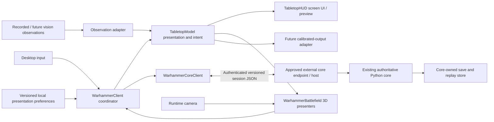
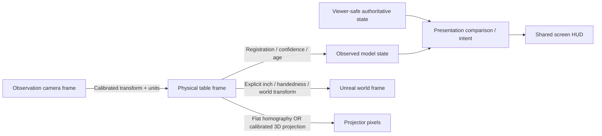

# Python/Arcade client → Unreal Engine: 3D-first migration plan

**Planning date / revision date:** 2026-10-02 / 2026-10-02  
**Revision:** 2 — approved client-only scope; Codex research-completion handoff.  
**Scope decision:** D01 / SCOPE01 **APPROVED**: retain the separate authoritative Python rules engine; this campaign changes the client only.  
**Research status:** **RESEARCH_INCOMPLETE** — RQ01–RQ24 require evidence-backed closure or an explicit blocked disposition.  
**Execution authority:** Research and planning only. Neither this revision nor D01 authorizes implementation, new executable experiments, external-core changes, or repository publication.  
**Canonical destination:** `docs/migration/unreal-migration-plan.md`  
**Review status:** Original single-session source/planning review, followed by document revision and consistency checks. No new repository inspection, online re-verification, application tests, Unreal build, feasibility experiment, or independent review was performed for this revision.

**Read section 0 first.** It is the immediate Codex assignment and takes precedence over the later prospective implementation tasks. Sections 1–16 preserve the migration design and historical research context, with scope-dependent language updated. The core remains an external dependency, not an implementation workstream. Exact engine/library versions and live-repository facts carried forward from the earlier plan must be revalidated through the research register.

### Revision 2 changes

D01 is closed by the owner; the former alternative core implementation workstream and its conditional milestones are removed. Integration remains read-only with respect to the external core. Section 0 adds RQ01–RQ24, evidence/owner closure rules and separate research, experiment and implementation gates. Affected sections/milestones link to those questions. E03 separates early delivery feasibility from final packaged-slice acceptance. Existing CAP, E, M, D and RISK identifiers are retained for traceability; RISK01 now addresses crossing the fixed ownership boundary.

## Contents

[Codex research gate](#0-codex-handoff-finish-research-before-implementation) · [Recommendation](#1-executive-recommendation) · [Baseline](#2-evidence-baseline-and-access-boundaries) · [Existing workflows](#3-existing-behavior-and-representative-execution-paths) · [Capability matrix](#4-scope-and-behavioral-contract) · [Architecture](#5-target-architecture-and-consequential-alternatives) · [3D design](#6-first-class-3d-design) · [HUD and reuse](#7-hud-architecture-percentage-sizing-and-reuse) · [Platforms](#8-platforms-enginetoolchain-and-delivery) · [Performance](#9-performance-assessment-and-proposed-budgets) · [Experiments](#10-feasibility-experimentsplanned-not-executed) · [Validation](#11-validation-strategy) · [Milestones](#12-ordered-implementation-milestones) · [Cutover](#13-coexistence-cutover-rollback-and-retirement) · [Risks and decisions](#14-risk-register-and-decision-appendix) · [Readiness](#15-review-readiness-and-first-bounded-work) · [Sources](#16-sources-and-inspection-index)

## 0. Codex handoff: finish research before implementation

**Current assignment: research and refine this plan only. Do not begin the implementation milestones.** The owner has approved retaining the separate Python rules engine. That decision is closed; the remaining work is to resolve client requirements, integration details, evidence gaps, and implementation prerequisites.

### 0.1 Fixed scope and authority

**SCOPE01 / D01 — APPROVED BY OWNER, 2026-10-02:** “I approve NOT replacing the rules engine. It is a separate code base and entity.” This campaign replaces the Arcade **client**. `Warhammer_40k_AI` remains an external, separately maintained authority. Do not reopen that decision, plan its retirement, or add core implementation work to a client milestone.

Read the core's public contracts, representative implementation, canonical fixtures, and relevant tests as integration references. Do not edit its source, tests, schemas, data, lockfiles, repository history, or release artifacts. A missing operation or incompatible contract becomes a documented **external dependency**, not permission to implement game rules in Unreal or patch the core. Record the needed operation, evidence, separate owner, affected client milestone, and unblock condition. The owner must authorize any separate core work outside this campaign.

Client-side connection handling, DTO parsing, presentation, input, configuration, and—if the deployment model is approved—process supervision and staging of an externally supplied core runtime remain client integration work. Producing a new Python host or changing the external service does **not** become authorized merely by calling it packaging. Resolve the host/artifact ownership explicitly in RQ04 and RQ17.

Genuine 3D from the first playable slice, C++-first client behavior, preservation of intended existing capabilities, and the bounded tabletop-presentation reuse demonstration remain requirements. Do not ask again whether these or Python-core retention are desired. Your next owner questions concern unresolved product choices, not settled scope.

### 0.2 Research procedure and evidence rules

Start with RQ01, then follow the dependencies in the register below. Inspect the exact local candidate, not only this plan's historical GitHub snapshot. Use concrete `repository@commit:path:symbol` references, relevant line ranges, and named test/fixture cases. For uncommitted source, record the base commit plus a patch/content hash; a branch name is not an immutable reference. Never place credentials, tokens, or private game state in the evidence packet.

Read surrounding callers, handlers, serializers and tests for end-to-end claims. A README, plan checkbox, schema entry, declared method, or passing parser alone does not establish a functioning user workflow. Record separately: **source supports**, **existing check actually passed**, **owner selected**, and **still requires execution**. A test not run, a fixture absent, or inaccessible source remains explicitly unverified.

Use current primary documentation when resolving engine/library/platform questions. Record the applicable version and retrieval date. The older source links and technical findings in sections 2–16 are inherited research inputs, not fresh verification of the machine or current branch. Version candidates are not mandates to install or upgrade anything.

Ask the owner directly for requirements or tradeoffs that source cannot decide. State the question, recommendation, alternatives, consequences, and blocked work. Ask early enough to unblock dependent research; batch related questions without repeating answers already recorded. Do not ask the owner to certify an API behavior that needs source or experimental evidence. Lack of evidence is not resolved by an optimistic preference.

You may inspect files and run existing non-destructive checks in an already prepared environment when permitted by the active instructions. Do not install tools, synchronize dependencies, create implementation scaffolding, change application code/tests/assets, create new executable experiments, modify shared sessions, move a shared checkout, or alter branches/PRs/remote state. Planning-document updates are the deliverable; publishing them requires whatever separate authorization the coordinator specifies. If a check writes caches or session data, first establish an approved isolated location and that it will not affect ongoing work.

### 0.3 Closure states and authorization gates

Use these states for **research items**, not for test results:

| State | Meaning |
|---|---|
| `OPEN` | The question or its evidence/decision is incomplete. This is the initial state of RQ01–RQ24. |
| `CLOSED_SOURCE` | Exact source, installed metadata, or applicable primary documentation answers the question; remaining execution obligations are separately identified. |
| `CLOSED_OWNER` | A product/authority choice is explicitly answered by the owner, with date and wording recorded; any technical assertions also have evidence. |
| `NOT_APPLICABLE` | Evidence and an approved scope decision establish that the item does not apply. This cannot be used to drop required parity or 3D scope. |
| `BLOCKED` | Required access, external artifact, unresolved contradiction, or empirical evidence prevents a responsible answer. Record the dependency and unblock condition. |

A mixed source/owner item closes only when both parts are resolved. Keep per-subquestion evidence when one row contains several requirements. A proposal, an assumption, an unexecuted experiment, or an owner's willingness to investigate is not evidence of technical success.

**G-RESEARCH — research complete:** all RQ items have supported closure/disposition; architectural/product choices that do not depend on experiments are settled; no required capability silently disappears; the plan and milestone prerequisites agree. Where an empirical question cannot be resolved from existing evidence, keep that subquestion BLOCKED and identify the exact bounded experiment. Do not report all research closed in that case.

**G-EXPERIMENT — optional next authorization, not granted here:** after completing the nonblocked research, present a bounded experiment packet for any remaining empirical blockers. It states permitted files, isolated environment, external dependencies, pass/fail criteria, stop conditions, and cleanup. The owner may authorize those experiments alone. That permits only the specified proof work—not broad feature implementation. A platform/native-runtime risk cannot be closed by reading its API documentation.

**G-IMPLEMENT — feature implementation authorization, not granted here:** requires G-RESEARCH, closure of the architecture-critical experimental blockers identified by RQ23, and explicit owner authorization of the refined implementation plan. Experiments already completed under separate approval are credited in M01/M02/E01–E04 rather than repeated automatically. Later behavioral, performance, packaged-build and release evidence remains mandatory at its milestone; it is not fictitiously required to exist before its implementation can be written.

The current output status must be one of `RESEARCH_INCOMPLETE`, `READY_FOR_BOUNDED_EXPERIMENT_AUTHORIZATION`, or `READY_FOR_IMPLEMENTATION_AUTHORIZATION`, with remaining blockers named. None of those statuses is permission to start implementation. Reversible details may be selected within the approved requirements; new commercial commitments, platform exclusions, feature removals, or incompatible data decisions require the owner.

### 0.4 Pre-implementation research register

**Every item below needs closure or an explicit blocked disposition before the handoff can be treated as implementation-ready.** “Blocks” identifies the affected work; it does not authorize unrelated implementation while the current assignment is research-only. `UI:` and `Core:` refer to the repositories in section 2. Paths are starting points from inherited research, not a claim that a later checkout has identical names or behavior. Follow renamed code and record its exact replacement.

#### RQ01 — Actual worktree, campaign, instructions and evidence baseline

**Status:** OPEN. **Resolve with:** source/environment inspection and coordinator confirmation. **Blocks:** all implementation; M00.

**Question:** Which checkout, revision, uncommitted changes, active campaign tasks and applicable instructions govern this migration? Is the installed core package the same revision as the sibling checkout and contract fixtures?

**Inspect:** UI root/nested `AGENTS.md`, `.codex/agents/`, `docs/plans/README.md`, `pyproject.toml`, `uv.lock`, `.github/workflows/ci.yml`, worktree/status metadata, and installed distribution provenance. Inspect core metadata read-only. Do not reset the sibling to an old pin.

**Close when:** a baseline manifest identifies actual source/installed/fixture identities, active ownership, permitted planning-output location, existing test results with their limits, and inaccessible resources. Hash any relevant dirty source rather than ignoring it.

**Ask the owner/coordinator:** which workspace and ongoing work to treat as authoritative when multiple candidates or conflicting ownership cannot be resolved from records.

#### RQ02 — Exact external contract and compatibility freeze

**Status:** OPEN. **Resolve with:** source plus coordinator/core-owner selection. **Blocks:** M01 and durable integration in M03; D02.

**Question:** Which exact core release/commit and contract must the Unreal client consume? Is the historical 42.0 target still intended, already superseded, or not ready? How are ongoing Phase 35 client changes incorporated without changing the external core here?

**Inspect:** UI dependency/compatibility declarations and Phase 35 material; selected Core `contracts/manifest.json`, migrations, schemas/examples and `docs/ADAPTER_DECISION_CONTRACT.md`. Compare the actual candidate with the historical 10.2 and 42.0 references rather than mixing them.

**Close when:** one version set, schema/content identity, compatibility policy, fixture source and change-freeze process are recorded. Separate inherited old-client behavior from intentional target-contract differences. A new external version does not silently rewrite the migration baseline.

**Ask:** which supported external release to target and who approves subsequent contract changes if existing records do not settle that choice.

#### RQ03 — Complete client-facing API and command lifecycle

**Status:** OPEN. **Resolve with:** exact source/contract tracing. **Blocks:** M01, M03–M05; E01, D05.

**Question:** What are the actual operations and payloads for connection/negotiation, session creation or attachment, start/advance, viewer projection, catalog, events, finite decisions, parameterized proposals, recovery and close? Which operations are absent?

**Inspect:** selected Core `adapters/contracts.py:AdapterGameSession`, `server.py:AdapterGameServer`, `http_transport.py:create_http_server`, `command_protocol.py`, session/sync/persistence modules, schemas and canonical positive/negative cases. Cross-check UI `core_client/local_session_client.py` and submission callers.

**Close when:** an operation table gives endpoint/method or supported alternative, request/response schemas and nullability, required privilege, session/viewer identity, request/result/command IDs, revision/cursor semantics, error behavior, and named evidence. Trace how a valid action advances and refreshes, not just how it is submitted. Identify schema references versus runtime discriminators distinctly.

**Escalate:** any needed missing public operation as an external dependency; never invent an endpoint, infer authority from an opaque payload, or add a private core-access path.

#### RQ04 — Deployment topology, external host and ownership

**Status:** OPEN. **Resolve with:** existing launcher/artifact source plus explicit owner choice. **Blocks:** architecture, M03/M07; D05 and RQ17.

**Question:** Must the client support offline local play, connection to an existing local service, remote service use, or a combination? Who supplies and maintains the Python server executable/runtime, configuration, credentials and updates?

**Inspect:** existing core release/launcher interfaces, supported CLI entrypoints, service configuration and artifacts; do not infer that an HTTP class is already a deployable host. Review sections 5.4 and 8.2 as proposals.

**Close when:** a launch-mode matrix specifies who starts/stops each process, how the endpoint and approved artifact are obtained, offline/network expectations, supported session ownership, and which repository/team owns missing delivery work. State whether this client stages an external runtime or only attaches to a service.

**Ask directly:** “Should the desktop client launch an owner-supplied local core runtime for offline play, connect to an already running service, or support both? Who owns delivery of that runtime?” Scope approval does not answer this deployment question.

#### RQ05 — Required platforms, Unreal build, toolchains and real test hosts

**Status:** OPEN. **Resolve with:** installed metadata, current primary documentation, owner requirements. **Blocks:** M01/M02 and package work; D03/D04.

**Question:** Are Windows x64 and Linux x86-64 the initial required targets? Which actual machines, GPU exposure, OS/window systems, engine build and native SDK/compiler can perform builds and rendered tests?

**Inspect:** UE `Engine/Build/Build.version`, installed compiler/SDK metadata, GPU/driver/CPU/RAM, existing CI hosts, and version-matched Epic platform requirements. Recheck the inherited 5.8 candidate and conflicting Linux documentation; do not install or upgrade to make the plan appear valid. Native dependency availability depends on RQ17.

**Close when:** the owner-approved platform matrix names build and rendered-test hosts, exact available or separately required toolchains, support exclusions, and installation/access blockers. A headless VM is not accepted as a substitute for missing render evidence.

**Ask:** required launch platforms, usable hardware and any engine-version restriction not discoverable from the environment. Do not reopen the retained-core scope when a platform lacks a local runtime; resolve deployment or record an external blocker.

#### RQ06 — User modes, viewer authorization and session identity

**Status:** OPEN. **Resolve with:** client/server source and owner product choice. **Blocks:** M03–M05; CAP29.

**Question:** Which modes are required: local single-player, hotseat, remote participant, spectator, or restricted debugging? How may the active viewer change, and which identity is allowed to issue a pending decision?

**Inspect:** UI `LocalSessionClient._projected_decision_for_status`, finite-decision refresh/viewer logic and display caches; Core access-control, shared redaction, session authorization and examples for each supported role. Trace request actor versus turn owner versus authenticated viewer.

**Close when:** an explicit role/mode matrix defines allowed reads/submissions, viewer switching, reconnect identity, hidden pending decisions, cache disposal and privileged test access. Never transplant a local “follow next actor” convenience into an authenticated remote client without authorization semantics.

**Ask:** which product modes must ship when source shows multiple possible modes but the intended migration requirement is unclear. Missing server support is an external dependency, not an invitation to bypass it.

#### RQ07 — Exhaustive implemented-behavior and interaction-variant inventory

**Status:** OPEN. **Resolve with:** end-to-end source and existing tests. **Blocks:** M01 and parity signoff M04/M05; E08.

**Question:** What does the current client actually implement, partially implement, deliberately reject, or only plan? Which apparent defects should not become requirements?

**Inspect:** `render/arcade_window.py` event handlers, `state/interaction_dispatch.py`, finite/movement/placement/assignment state and submission modules, HUD, preferences, all relevant tests, and active/finished plans. Enumerate each selected submission variant, including multi-variant and nested requests—not merely the 13 interaction-kind names or a coverage count.

**Close when:** every CAP01–CAP36 row has a specific variant/workflow checklist, source symbols, existing test/procedure, positive and failure behavior, disposition and responsible milestone. Clearly distinguish assertions inspected from checks actually run and remove no capability silently.

**Ask:** only for intended behavior where source/tests/requirements conflict or a material redesign/removal needs approval. Do not ask the owner to reconstruct behavior the source can establish.

#### RQ08 — First real-core playable scenario and meaningful action

**Status:** OPEN. **Resolve with:** canonical fixtures, supported public setup and existing check evidence. **Blocks:** M03; E01/E03.

**Question:** Which exact scenario reaches a decision and supports a meaningful action through the approved external API? Does the fixture actually reach movement, and what path witness and resulting state change will prove acceptance?

**Inspect:** UI `core_client/live_smoke.py:build_live_core_smoke_startup`, launch/smoke documentation and existing integration tests; selected Core canonical setup fixtures and public example sequences. Do not treat named late-phase checkpoint options as reachable without evidence.

**Close when:** a version-bound recipe names initial data, viewer, ordered setup decisions, action payload source, expected accepted/invalid outcomes, relevant Z/geometry data, and planned packaged test procedure. Record whether the recipe was exercised using an existing authorized check. Keep synthetic geometry evidence separate from legal game-state evidence.

**Escalate:** unavailable fixtures or unsupported actions to the core owner. Obtain an external fixture or revise the proposed slice explicitly; do not author private core mutations or accept a no-op screenshot as proof.

#### RQ09 — Coordinate, elevation, footprint and geometry contracts

**Status:** OPEN. **Resolve with:** exact schemas, serializers and geometry examples. **Blocks:** M02/M03; D08/D09, E02.

**Question:** What are the units, handedness, origin/datum, facing basis, transform semantics, shape variants, support surfaces, measurement basis and elevation fields at every boundary? Which core geometry is present versus only visually suggested?

**Inspect:** Core `adapters/battlefield_projection.py`, pose/path-witness serialization and target schemas; UI `render/core_projection.py`, `camera.py` and `view_models.py`. Resolve the capsule support/emission discrepancy and any mismatches between proposal and projection coordinate field names.

**Close when:** a field-level mapping preserves Z/facing and opaque context, defines inverse transforms/tolerances, distinguishes support/measurement/query/visual geometry, and specifies asymmetric, nonzero-origin and raised fixtures. The Y reflection in section 6 is a candidate mapping to verify against the actual source basis.

**Ask:** only for presentation choices the core does not determine. Missing authoritative geometry must remain a typed unsupported state, not a cosmetic fallback promoted to legal dimensions.

#### RQ10 — Input arbitration, camera controls and cancellation semantics

**Status:** OPEN. **Resolve with:** actual handlers/tests plus owner ergonomics choices where necessary. **Blocks:** M02–M05; CAP12/CAP13/CAP21.

**Question:** Which pointer/keyboard events are consumed by HUD, modal, camera, selection and each draft editor? What happens on drag threshold, focus loss, Escape, right-click, pending submission and resize?

**Inspect:** UI `ArcadeWarhammerWindow.on_mouse_press/on_mouse_drag/on_mouse_release/on_mouse_scroll/on_key_press`, preference bindings, selection/draft reducers and existing event tests. Reconcile old right-drag/right-click meanings with the new orbit gesture rather than copying either blindly.

**Close when:** a complete event-ownership/state-transition table specifies priorities, capture/release, click-versus-drag, modifiers, remappable alternatives and draft retention/cancellation; source-backed behavior and intentional changes are labelled. Camera events issue no game commands. The viewport/HUD coordinate policy is explicit.

**Ask:** about meaningful workflow changes or indispensable control preferences; otherwise choose documented reversible defaults within the current requirement. New Unreal input proof belongs to E02/E04 after authorization.

#### RQ11 — Full preference/HUD dialect and data compatibility

**Status:** OPEN. **Resolve with:** actual parsers, resources and tests; upstream parser documentation. **Blocks:** M02/M05; D07/D10, E04.

**Question:** Which JSON/YAML features and preference semantics are really supported, including percentages, fixed sizes, aliases, unknown keys, diagnostics, inactive fields, extensions, built-in IDs and path resolution?

**Inspect:** UI `preferences/`, `hud/composition.py`, toolkit/layout/render modules, packaged `resources/`, `docs/ui-configuration.md`, `docs/hud-customization.md`, representative profiles and parser tests. Verify the current loader, not PyYAML's entire theoretical feature set. Review the native parser candidate/version and compile/runtime requirements from its actual source.

**Close when:** a complete supported input corpus and field-by-field mapping cover preserved values, optional/new fields, warning/error severity, production versus preview data, sizing and overflow behavior, safe path handling and import/export round-trips. New tests/converters are specified, not written during research.

**Ask:** for approval of any unavoidable compatibility break. Parser differences, unsupported widgets and inactive settings cannot silently disappear.

#### RQ12 — Responsive HUD policy and C++/UMG/Slate seam

**Status:** OPEN. **Resolve with:** current UI requirements, version-matched Epic APIs and owner choices for material UX changes. **Blocks:** M02/M05; D06, E04.

**Question:** How will percentage allocation, DPI/text scaling, minimum/maximum width, reflow, scroll/focus, viewport framing and file-based customization coexist? What belongs in C++ versus authoring assets?

**Inspect:** existing HUD presets and bindings, parent allocation behavior, targeted UMG/Slate APIs and layout-testing facilities. Treat the 25%/288–480/sidebar-drawer example as a proposed policy, not existing behavior or already approved pixel limits.

**Close when:** specify layout trees, normalized composition interface, exact sizing coordinate space, legacy fixed-size mapping, narrow-screen behavior, typography/focus rules, preview reuse and acceptance matrix. Identify a small UMG/Slate proof only where source/docs cannot settle a consequential layout issue.

**Ask:** whether a material loss/change to current customization is acceptable; do not replace existing editable profiles with fixed screens. C++-first applies to client behavior; editor-authored visual configuration remains a separate authoring choice.

#### RQ13 — Source assets, visual definitions and cooking inventory

**Status:** OPEN. **Resolve with:** source/resource inspection. **Blocks:** M02/M05/M07; D09, E02.

**Question:** Which battlefield/HUD resources are procedural, raster/atlas, font or other content? How do identifiers, paths, pivots, physical footprint data and visual fallback behavior currently work?

**Inspect:** `render/primitives.py`, render hints, resource loaders, `resources/`, icon/font registries, guidance documents, package inclusion rules and tests. Follow actual use sites; do not infer absence from an incomplete directory sample.

**Close when:** an asset manifest records source/provenance, usage, visual mapping, import/UV/filter/pivot settings where applicable, cooked retention, missing-art diagnostics and unchanged identity/query/measurement contracts. All five visual footprint forms and a normal-mesh substitution have a bounded proof design. Distinguish harmless missing art from missing required geometry.

**Ask:** only about necessary visual substitutions or unlicensed/missing required resources. Detailed miniatures, paid artwork, animation and a full replacement art library are not prerequisites.

#### RQ14 — Destination project layout, authoring and binary ownership

**Status:** OPEN. **Resolve with:** repository conventions plus owner/coordinator decisions with persistent consequences. **Blocks:** creation of any implementation project/assets; D14.

**Question:** Where will the Unreal project/plugin live, how are runtime/editor dependencies enforced, and how will generated and binary content be reviewed and versioned?

**Inspect:** current repository/instruction hierarchy, CI conventions, existing `.gitattributes`/LFS arrangements, any destination Unreal scaffold and available generation/commandlet tooling. The module names and `unreal/WarhammerClient/` path in this plan are proposals unless found in source.

**Close when:** a file/module ownership and dependency map names the approved destination, C++/editor-authoring seam, textual generation inputs, semantic rebuild validation, cook dependencies, binary single-writer policy, and isolated outputs. No runtime module depends on an editor-only module or future vision SDK.

**Ask:** before selecting a separate repository, changing remote storage/LFS or introducing other durable organizational commitments. Do not create the project, import content or change source-control settings in the research phase.

#### RQ15 — Retries, concurrency, security and process failure behavior

**Status:** OPEN. **Resolve with:** selected protocol/host implementation and existing negative tests. **Blocks:** M03/M07; E01/E03.

**Question:** What happens for out-of-order responses, wrong viewers, duplicate/conflicting commands, uncertain commit, server restart, persistence failure, stale cursors and process shutdown? Which request/resource limits and credential mechanisms already exist?

**Inspect:** command journal/fingerprint/revision handling, authorization/redaction, event cursors, server lock/persistence paths and HTTP wrapper. Verify selected-version behavior, not only the historical methods summarized in section 5.4.

**Close when:** a client/host responsibility matrix and state diagram define bounded requests, pending/unknown outcomes, same-ID retry, reconciliation, draft invalidation, callback generations, viewer cache teardown, safe logging, credentials, launch/readiness/exit and owned-process termination. Identify limits enforced externally versus in the client; client validation alone is not server protection.

**Escalate:** missing host safeguards as external dependencies. Ask the owner about deployment trust/network exposure, not whether undocumented deduplication “probably works.” Empirical crash/commit-order proof remains E03.

#### RQ16 — Existing data, saves/replays and actual resume requirements

**Status:** OPEN. **Resolve with:** all current data entrypoints and explicit owner preservation requirements. **Blocks:** architecture and M05/M06/M08; D11, E06.

**Question:** What user data must survive, which save/resume/export controls actually exist, and must old/new clients continue an in-progress session interchangeably? Core persistence APIs do not establish an existing UI resume flow.

**Inspect:** UI file dialogs, CLI/settings/profile IO and tests; Core public replay/session-persistence interfaces, artifact version identity and canonical examples. Enumerate formats, locations, writers, migrations and recovery paths without opening sensitive real saves unnecessarily.

**Close when:** a data inventory defines keep/copy/convert/reject behavior, version routing, backup strategy, one-writer rules, visibility, and exact default-switch versus gameplay-resume guarantees. Preserve originals; conversion must not change external core formats or integrity semantics.

**Ask directly:** which existing profiles/sessions need continuity and whether midgame switching back to Arcade is required. Unsupported recovery or irreversible conversion is a blocking choice, not an assumed acceptable loss.

#### RQ17 — External runtime artifacts and reproducible client packaging

**Status:** OPEN. **Resolve with:** owner-supplied delivery contracts/artifacts, build metadata and platform documentation. **Blocks:** M03/M07; E03; depends on RQ04/RQ05.

**Question:** For each approved launch mode, what exact core/runtime/native-library/data artifact does the client consume, where does it come from, and who proves its relocation, licensing and supported platform behavior?

**Inspect:** external release manifests or approved build recipe, Python/native dependency closure and data paths, client staging/cooking mechanisms, version negotiation and update procedures. Candidate library floors in the old plan are not an installable lock or a distributable runtime.

**Close when:** a reproducible consumption/staging design specifies platform/architecture, immutable hashes, runtime ownership, endpoint/host configuration, user-writable directories, native loading, offline prerequisites where required, and clean-machine test/repair procedures. Attach-only delivery must be explicitly selected rather than silently substituted for offline play.

**Escalate:** a missing core host/runtime package to its separate owner. A packaging proposal can be complete while feasibility is still blocked pending E03; do not declare a portable bundle from source metadata alone.

#### RQ18 — Performance baseline, workloads and acceptance budgets

**Status:** OPEN. **Resolve with:** existing measurement paths, hardware inventory and owner priorities. **Blocks:** performance claims and final test design; M02/M03 instrumentation, M07 acceptance; E05.

**Question:** Which hardware/workloads represent the product, and are the provisional latency/frame/startup/memory budgets appropriate? What baseline can be measured without changing the old application or core?

**Inspect:** draw/update/layout/input paths, existing profilers/traces/benchmarks, real-core scenario startup, available native test hosts and Phase 35 measurement notes. Run existing safe checks only when permitted; missing instrumentation is a future task, not an excuse to fabricate measurements.

**Close when:** distinguish measured data from proposed targets; name workload identities, sampling/warm-up/statistics, hardware, client/transport/core timing boundaries and repeatable procedures. Select benchmark and render hosts and define how unmet targets are escalated.

**Ask:** minimum supported hardware or responsiveness priorities if not documented. Retain the external core as measured dependency; a slow core outcome does not expand this migration into engine optimization.

#### RQ19 — Bounded tabletop reuse and observation contracts

**Status:** OPEN. **Resolve with:** architecture/dependency analysis and existing requirements. **Blocks:** shared-interface freeze and M06; D13, E07.

**Question:** What exact shared presentation/command/registration contracts let a separate host reuse HUD functionality without a simulated battlefield camera or a production CV stack?

**Inspect:** proposed module dependencies, existing entity/HUD binding semantics and supported public decision path. Specify rather than implement synthetic/recorded observation envelopes, identity registration, clock/frame/unit metadata, stale/lost/ambiguous state and manual correction.

**Close when:** define shared versus host-specific types, observed versus authoritative ownership, transform/calibration separation and a minimal separate-host acceptance sequence. State precisely what the synthetic demo proves and what needs a later hardware project. Nothing observes a physical move and directly commits it as legal gameplay.

**Ask:** only for a necessary unresolved reuse requirement. Do not block this migration on camera/projector purchases, recognition accuracy, production calibration, or a hardware stack not requested here.

#### RQ20 — Test architecture, safe execution, CI and independent review

**Status:** OPEN. **Resolve with:** actual tests/CI/agent facilities and version-matched test documentation. **Blocks:** M01 and each evidence gate; RQ23/RQ24.

**Question:** Which checks already exist, which must be implemented later, where will headless/rendered/packaged tests run, and can genuinely separate review and acceptance sessions be invoked?

**Inspect:** existing tests/helpers/fixtures, import-boundary script, CI jobs/check results, selected UE Automation/low-level/Driver facilities and `.codex/agents/` responsibilities. Verify available execution facilities; a configuration file is not proof that a reviewer ran independently.

**Close when:** each capability and experiment maps to a test layer, source/fixture, execution host, expected test count/result artifacts and future command where not yet implemented. Define no-install research checks, private-data isolation, fake-versus-real core boundaries and exact review packets. Never invent a working `Warhammer.Migration` suite.

**Ask:** for missing CI/render-host access or review/campaign policy choices. Record an unavailable review as BLOCKED/not performed rather than role-playing independence.

#### RQ21 — Distribution intent, provenance and commitment boundaries

**Status:** OPEN. **Resolve with:** owner distribution intent, artifact manifests and appropriate primary/legal review. **Blocks:** unapproved dependencies/content commitments and M07/M08 external release.

**Question:** Is the initial deliverable an internal/local development client or an externally distributed product, and who is responsible for clearing the client, external runtime, fonts/art and Warhammer-related content?

**Inspect:** existing licenses/provenance and chosen dependencies, current official license terms for the intended use, available rights records and release process. Inherited source links are not permission to redistribute. Do not make legal conclusions from public repository visibility or carry an access-denied page as verified evidence.

**Close when:** record intended distribution, permitted development resources, required notices/reviews, artifact ownership and explicit external-release blockers. Final legal clearance may remain a release gate if it does not block the approved development scope; it must not be described as obtained.

**Ask:** for distribution intent and approval of any commercial/storage commitment. Core ownership remains separate; consuming its approved artifact does not grant authority over its source or content rights.

#### RQ22 — Coexistence, ongoing client changes and cutover policy

**Status:** OPEN. **Resolve with:** campaign/source/data evidence plus owner/coordinator choices. **Blocks:** M01 scope control and M06/M08; D11.

**Question:** How will ongoing Arcade work affect the migration baseline, who maintains both clients during transition, and what precisely changes when Unreal becomes default?

**Inspect:** active Phase 30/32/35 work, merge/branch coordination, installation/launch paths, preference/data stores and the RQ16 compatibility matrix. New external core releases are dependency changes, not core work owned by this plan.

**Close when:** define acceptance of ongoing bug fixes/capability additions, versioned fixture updates, separate executables/runtimes, exclusive session writers, default-selection routing, rollback limits, signoff and later retirement evidence. Distinguish candidate architecture from an authorization to modify launchers or release defaults now.

**Ask:** who triages scope changes and approves freeze/cutover/retirement. Do not let a launcher flag imply that incompatible saves or sessions can move backward.

#### RQ23 — Uncertainty-to-experiment map and non-circular gates

**Status:** OPEN. **Resolve with:** findings from RQ01–RQ22. **Blocks:** any readiness claim or experiment/implementation request.

**Question:** Which answers are now established, which require a new experiment, and which experiment must pass before committing to the affected architecture or milestone?

**Inspect:** E01–E08, their actual setup dependencies, available existing evidence and proposed M01–M08 sequence. Split source-inspection portions from new harness/prototype work. Reuse existing proof only when exact versions, environment and acceptance match.

**Close when:** each empirical gap names the bounded experiment, prerequisite artifacts, allowed write scope, owner/access needed, pass/fail evidence, blocked decision/milestone and failure alternative within the fixed client scope. Critical transport, target-platform/runtime, 3D-picking or HUD-architecture uncertainty is resolved before broad dependent implementation. Later acceptance tests are not incorrectly treated as preexisting research evidence.

**Ask:** for bounded experimental authorization when necessary. Keep the empirical subquestion BLOCKED until actually tested; authorization is not a passing result. Failed external-core feasibility is not permission to add core changes.

#### RQ24 — Decision reconciliation and final research handoff

**Status:** OPEN. **Resolve with:** evidence/decision audit and owner answers. **Blocks:** G-RESEARCH / G-IMPLEMENT.

**Question:** Does one self-contained plan now describe the actual baseline, selected design, remaining experimental/release gates and a safe first authorized step without contradictory “proposed” versus “approved” claims?

**Inspect:** all RQ states, D01–D14, CAP01–CAP36, G01–G10, E01–E08, RISK01–RISK18, source index, owner responses and milestone prerequisites. Verify that each discovered new gap has an ID and owner; do not hide new blockers in prose.

**Close when:** update the canonical plan and decision log; link every resolution to exact evidence or dated owner choice; resolve cross-references/ordering; report tests passed/failed/not run and review performed/not performed separately. Record the remaining empirical subquestions and release-only obligations, and supply the precise next bounded work packet.

**Ask:** only remaining material owner decisions, then request the appropriate next authorization. Do not ask again about retaining the Python rules engine. Scope approval and a research-ready plan do not authorize feature implementation.

### 0.5 Required closure record

Store the question/status/decision in this canonical plan; supporting evidence may live under `docs/migration/evidence/research/` once that documentation location is approved. Do not create a second competing checklist. Use a record like this for each item; paths and values below are placeholders, not completed evidence:

```yaml
id: RQ03
status: OPEN
question: Exact command lifecycle and client-facing operations
resolution: null
source_evidence: []  # repository, commit, path, symbol, lines; dirty-source hash if relevant
primary_docs: []     # URL, applicable version, retrieved_at, supported claim
owner_decision: null # date, question, answer, affected scope
checks: []           # exact command/environment, test count, actual outcome, artifact path
empirical_gaps: []   # unresolved subquestion, E-ID, prerequisite, blocked decision/milestone
external_dependencies: [] # separate owner, needed artifact/API, evidence, unblock condition
affected_sections: ["5.3", "5.4", "11", "M01", "M03"]
affected_decisions: [D02, D05]
reviewer: null
```

Source-only closure must say that no new runtime behavior was validated. Owner-only closure must not masquerade as technical verification. A new source/contract/toolchain revision invalidates only the conclusions it affects, but those conclusions must be reopened rather than silently carried forward.

### 0.6 Planning outputs and first owner-question bundle

The research handoff consists of the updated canonical plan, source-backed closure records, a concise unresolved-owner-question list, an external-dependency list, the version/fixture/host manifests, and the RQ23 experiment packet where needed. Preserve the full architecture, 3D/HUD requirements, behavior matrix, milestones and cutover criteria; this register is not a replacement for them.

After checking for existing answers, the likely early owner questions are the exact target core release (RQ02), local/remote/offline launch and external host ownership (RQ04), initial platforms/test hardware (RQ05), required user/viewer modes (RQ06), required saved-game continuity (RQ16), and internal versus external distribution intent (RQ21). Later questions may concern binary storage or material workflow changes. Ask only those still unresolved by source or prior explicit decisions.

### 0.7 Pasteable Codex assignment

> Continue this document in **research/planning-only mode**. The owner has approved a client-only Unreal migration with `Warhammer_40k_AI` retained as a separate authoritative Python codebase; D01 is closed and must not be asked again. Read the actual workspace instructions and source, then resolve RQ01–RQ24 with immutable code references, applicable primary documentation, permitted existing checks, or direct owner answers for product decisions. Update the canonical plan and record remaining external dependencies. Do not modify client/core application code, tests, assets, dependencies, repository history or remote state, install tools, or create new executable experiments. Where a question needs execution not available through an existing safe check, leave it explicitly blocked and prepare the bounded experiment/authorization packet in RQ23. Finish with the updated plan, evidence, remaining questions, actual review/test status and precise next authorization needed. Do not begin implementation merely because research or scope is approved.

## 1. Executive recommendation

Build a **C++-first Unreal client in a genuine 3D scene**, consuming the separate authoritative Python rules engine through its public, versioned session boundary. Retaining that engine is **approved scope**, not an open architectural alternative. Reusing its existing HTTP/session protocol is the recommended client integration, subject to RQ02–RQ04 and RQ15 verification. Make the battlefield, runtime camera, world picking, ordinary mesh substitution, nonzero-elevation presentation, and packaged execution part of the first functional slice—not later enhancements.

The owner explicitly approved this separation on 2026-10-02. The source boundary described in the original research is consistent with that decision: the client renders and submits intent, while the separate core owns rules and authoritative state. [R01] [R02] [R09] [R18] [R24] [R25] Core API/fixture inspection and client integration remain necessary; source changes, rule reimplementation, data-model redesign and core retirement are outside this campaign. A missing external capability is a dependency to escalate, not an Unreal workaround. All remaining decisions are tracked in section 0.

The recommended destination is:

- **Unreal C++:** client application behavior, interaction editors, viewer-scoped presentation state, camera, selection, HUD, configuration, diagnostics, observation adapters, and asset selection.
- **External Python core, unchanged by this campaign:** authoritative rules, lifecycle, legal decision generation/validation, geometry semantics, randomness, catalog identity, replay, and authoritative persistence. Its owner maintains its code and release artifacts; the client consumes an approved version through the public boundary.
- **Editor-authored or generated content:** materials, meshes, fonts, visual definitions, and a small amount of UMG composition where useful. Authoritative behavior does not move into Blueprint graphs.

Use **UE 5.8 as the candidate engine line**, with the exact patch/build and compiler pinned after local preflight. Epic documents a released 5.8 line and the required desktop/UI/runtime facilities. Nothing discovered requires a paid plugin, detailed miniature library, Lumen, Nanite, a character controller, or a new rules framework. The installed engine and graphics environment remain unknown; this is a conditional recommendation, not a tested toolchain selection. [U01] [U02] [U03] [U04]

**The important findings change the plan materially:**

1. The current frontend is pinned to core **10.2.0**, while active Phase 35 targets **42.0.0**. Mixing their fixtures, installed packages, schemas, or saves is not a migration strategy. [R02] [R04]
2. The core already exposes **right-handed, Z-up inch coordinates, Z positions, model heights, and terrain volumes**. The Arcade render adapter reduces several of these paths to X/Y. The Unreal boundary must preserve the original data rather than recreate that flattening. [R10] [R11] [R19]
3. The inspected battlefield renderer primarily produces **procedural polygons, circles, polylines, and text**. Reuse those meanings as geometry/materials; do not commission an unnecessary image-conversion pipeline. Asset hints exist, but a complete source-art inventory is still a local preflight item. [R12]
4. The HUD already has **shareable YAML composition, named bindings, layout profiles, and live/preview parity**. Fixed UMG screens alone would lose user-visible capability. [R13]
5. A default launch is a **fixture mode**; the real-core smoke path is explicit. A rendered board, a passing parser, and a playable core-connected client are different acceptance levels. [R16]

### Approved scope; remaining research

**D01 — CLOSED / APPROVED:** replace the Arcade client while retaining `Warhammer_40k_AI` as a separate authoritative Python codebase. No further scope confirmation is needed.

**Not approved merely by D01:** a specific core release, HTTP endpoint availability at that release, managed local runtime versus attach-only deployment, initial platform matrix, dependency adoption, incompatible data changes, or starting implementation. Resolve these through RQ01–RQ24. Do not turn the owner's approval of the boundary into approval of every proposed deployment detail.

## 2. Evidence, baseline, and access boundaries

**Pre-implementation closure:** RQ01/RQ02 establish the actual candidate and versions; RQ24 verifies the evidence index. Historical snapshots are not current worktree claims.

### 2.1 Evidence vocabulary

**V — Verified source in the original research:** directly inspected at an immutable repository revision as recorded in section 16. Carried forward here; not a claim of fresh inspection or runtime success in this revision.  
**D — Documentation-backed in the original research:** supported by the primary-documentation references in section 16, which used the 5.8 candidate line unless stated otherwise. Revalidate live/version-sensitive details before adoption.  
**P — Proposed:** architecture, budgets, bindings, interfaces, filenames, experiments, or acceptance criteria chosen by this plan.  
**U — Unverified:** requires worktree access, execution, additional source tracing, owner choice, or hardware evidence.

Sections describing the destination, experiments, and future milestones are **P** unless explicitly marked V/D. Existing commands are identified separately from proposed commands. Unknown is never PASS.

### 2.2 Immutable inspected baseline

| Item | Inspected value | Meaning and evidence |
|---|---|---|
| UI repository | `SobolGaming/Warhammer_40k_UI_arcade` | Companion client, not the authoritative engine. [R01] [R02] |
| UI revision | `c54278b6d81de8a9d963cab25c0bdae531dd03b6` | Main snapshot inspected for this plan; commit describes Phase 35 M1 fixture gating/inventory. |
| UI package | `warhammer40k-arcade-ui`, `0.1.0` | Package metadata, not a statement of product completeness. [R03] |
| Python | UI requires `>=3.14.5,<3.15`; documented target `3.14.5` | Installed interpreter was not inspected. [R02] [R03] |
| Arcade | Lockfile `3.3.3`; declared constraint `>=3.3` | Locked version verified; installed distribution unknown. [R03] [R05] |
| Core repository | `SobolGaming/Warhammer_40k_AI` | Separately owned authoritative engine. Not the similarly named older repository. [R01] [R02] |
| Current supported core | `dbfcc3a99e9d560d1354506352a09d48ca555a94`; external contract `10.2.0` | Declared UI dependency and CI checkout. Core source in this plan was inspected at this revision. [R02] [R03] [R06] |
| Active migration target | `6e86f44b87c4559a9297596d5d18dc4247b8cbc3`; external contract `42.0.0` | Target recorded in Phase 35, **not** evidence the inspected UI already supports it. [R04] |
| Core package/dependencies | `warhammer40k-core-v2` `0.1.0`; Python `>=3.14,<3.15`; orjson, msgspec, Pydantic, Shapely, NumPy, jsonschema, referencing | These include deployment-sensitive dependencies; exact installed versions and complete native-library closure are unverified. [R17] |
| Package licenses | Both inspected pyprojects say `Proprietary` | Not a determination of rights to redistribute all included data or artwork. [R03] [R17] |

Relevant declared core floors are orjson 3.10, msgspec 0.19, Pydantic 2.11, Shapely 2.1, NumPy 2.2, jsonschema 4.23, and referencing 0.36. These are **constraints, not resolved versions**. Do not replace the project's lockfiles with those lower bounds. [R17]

### 2.3 What this session did and did not establish

**Original research record, carried forward:** read-only GitHub inspection covered root instructions, architecture/planning material, package/build configuration, representative source paths, a conformance test, the lockfile's Arcade entry, review-agent definitions, and the core adapter/server/projection boundary. Public Epic documentation was researched. The combined commit-status query returned no legacy status contexts; that does **not** establish that GitHub Actions checks passed or failed.

The remote `Warhammer-UbuntuDev` machine, its live campaign state, branch/worktree, uncommitted files, actual installed distributions, GPU/driver, compiler, Unreal installation, and test results were **not accessible for verification**. No full checkout was available in the working container. A network attempt to obtain a source archive did not establish a local checkout. No code, tests, dependencies, assets, commits, branches, PRs, or remote state were changed. This deliverable is a repository-ready documentation copy, not a claim that it was installed into the live repository.

Inspection was representative, not exhaustive: every event handler, every persistence path, every nested instruction file, and every asset/test was not reviewed. These gaps are explicit RQ01–RQ24 research work, with new executable proofs separately gated under section 0. In particular, the authoritative **42.0.0 implementation and HTTP behavior need target-revision re-verification**; the directly inspected server code here belongs to the current 10.2.0 pin.

### 2.4 Campaign coordination

The UI instructions forbid modifying the sibling core, require a public core boundary, prohibit UI-owned legality, and require viewer-safe state/diagnostics. Existing plans distinguish completed phases from active/proposed work. Phase 30 assignment, Phase 32 opportunity-tray, and Phase 35 contract work must not be declared completed merely because this migration plan covers their subject areas. [R01] [R04] [R07]

The repository has separate `sol_code_reviewer` and `astra_auditor` definitions. Their responsibilities are frozen-candidate defect review and acceptance-evidence audit; both permit BLOCKED and explicitly prohibit invented validation. The reviewer definition also says its instructions do not themselves establish session isolation. Preserve these responsibilities, but record actual fresh-session runtime evidence before calling a review independent. Neither agent was run for this plan. [R14] [R15]

Register this plan as **scope approved / research incomplete**, linking it from `docs/plans/README.md` only when the coordinator authorizes that documentation integration. Do not supersede Phase 35, change its status, or merge an implementation branch as part of adopting this document.

## 3. Existing behavior and representative execution paths

**Pre-implementation closure:** RQ03/RQ06–RQ11/RQ13/RQ16 complete the representative source traces and identify real behavior. These sections are not an exhaustive acceptance inventory.

### 3.1 Responsibility and mutation map

The source-backed path is:

```text
User input / local workspace intent
    -> Arcade client decision/submission orchestration
    -> LocalSessionClient (public core facade)
    -> AdapterGameSession / LocalGameSession
    -> authoritative lifecycle, rules validation, state, event/replay history
    -> viewer-scoped projection and diagnostics
    -> UiGameView / local presentation state
    -> battlefield_view_from_game_view
    -> procedural world primitives + HUD presentation/composition
    -> Arcade rendering
```

`LocalSessionClient` validates the supported core contract at construction, submits finite options with engine request/option IDs, submits JSON-safe parameterized payloads, and translates defined core failures into UI errors. Catalog caching uses `(catalog_id, source_hash)`. These are concrete boundary behaviors to retain, not classes to copy verbatim. [R09]

### 3.2 Launch and real-core smoke

`app.py:create_window` distinguishes `live_core_smoke` from the normal fixture path. For a live smoke it invokes `core_client/live_smoke.py:build_live_core_smoke_startup`, then supplies the resulting battlefield, game view, status, catalog, support profile, core client, viewer, and event cursor to `ArcadeWarhammerWindow`. A typed smoke startup failure produces a diagnostic window/crash-report path, rather than silently pretending a working game exists. Without live smoke, the recorded runtime mode is `fake_fixture`. `run_app` creates the window and enters Arcade's event loop. [R16]

The README documents setup, reserve declarations, deployment, redeploy, prebattle, Scout Move, and movement checkpoints. It also states that the canonical fixture becomes terminal before shooting/charge/fight; recognizing those CLI strings is not proof of reachable gameplay. Preserve that distinction in the new launcher and evidence labels. [R02]

### 3.3 Movement proposal → core → refreshed presentation

`state/movement_submission.py:prepare_movement_submission` checks that a draft and pending parameterized request exist, that the interaction route is supported, and that request ID, spatial-context hash, submission variant, and projection context still match. It requires a ready payload and allocates a result ID. `submit_movement_draft` orchestrates submission and subsequent refresh through the client/state boundary. These checks protect context and UI readiness; they do not replace core movement legality. [R08]

`LocalSessionClient.submit_parameterized_payload` forwards the request, payload, and result identity to the session. The resulting status is paired with a projected pending decision using the relevant viewer; `get_view` obtains the authoritative viewer-safe projection. `battlefield_view_from_game_view` builds render objects from canonical `battlefield_view` data, and `build_world_primitives` produces procedural board/entity/overlay primitives. [R09] [R10] [R12]

**Remaining source-trace gap:** characterize the complete gesture-to-draft handler sequence, including focus/cancellation and draft retention on each error, in the actual worktree. The orchestration/client/projection path above was inspected, but not every `ArcadeWarhammerWindow` event branch. M01 must capture semantic input traces, not infer them from this paragraph.

### 3.4 Coordinates and geometry

`render/camera.py:WorldCamera` converts tabletop **inches** to screen pixels and back; its zoom is pixels per inch, clamped to 4–96. `fit_table` uses table dimensions; `pan_screen`, `zoom_at_screen_point`, and resize preserve world-space intent. Thus, the current implementation is not simply a pixel-coordinate rules engine. [R11]

The canonical core projection explicitly declares `battlefield_inches_right_handed_z_up`. Model poses include `z_inches` and `facing_degrees`; geometry distinguishes support shape, measurement shapes, measurement basis, and height; terrain features include positioned wall/floor volumes. Measurement and path overlays also carry 3D positions. [R19]

The UI adapter's `_canonical_position` reads X/Y only; its view model stores 2D positions, and canonical board handling rejects a nonzero X/Y minimum. Its `_canonical_model` combines local footprint rotation with model facing to construct render polygons. These are boundaries to redesign, not desired restrictions in Unreal. [R10] [R11] [R27]

The UI converter handles circles, rectangles, ellipses, capsules, and polygons. The inspected core `BattlefieldShapePayload` type lists circle/ellipse/rectangle/polygon, not capsule. Preserve visualization support for all five shapes, but resolve the current emitted-shape/schema discrepancy with real fixtures before calling capsules a currently emitted core feature. Do not infer game measurements from polygon tessellation or mesh extents. [R10] [R19]

### 3.5 Existing visual and HUD behavior

`build_world_primitives` renders a table polygon, deployment areas/cutouts, objectives, terrain, units, authoritative overlays, and advisory workspace/selection/movement feedback. Its primitive types are polygon, circle, polyline, and text; the inspected path is procedural. It preserves core-provided measurement distances for display. There is no evidence here that an image atlas or tilemap is the main battlefield asset source. A full packaged-resource/icon/font inventory remains required. [R12]

The HUD documentation separates preferences, composition, named presentation bindings, and rendering. Built-in layouts include `compass_ring` and `command_bench`; zone visibility/sizes, text scale, high contrast, movement ring modes, assignment highlights, themes, icons, and overflow behavior are presentation-only. YAML is used by the live HUD and preview renderer. Built-ins are packaged resources, not runtime dependencies on the top-level `docs/` directory. Production profiles prohibit preview `sample_data`. [R13] [R02]

### 3.6 Testing and delivery baseline

CI is Ubuntu-based and separates quality, fast tests, real-core integration, and aggregated coverage. The UI's configured coverage floor is 75%; the core's is 85%. These thresholds are not measured coverage in this report. The workflow builds the Python distribution; no inspected workflow establishes equivalent native Windows/macOS packaged-game support. [R03] [R06] [R17]

`tests/test_contract10_conformance.py` checks strict parsing, interaction routing, contract fixture availability, catalogs, support profiles, and event envelopes. Its post-deployment fixture expects a **44 × 60 inch board, two units, six objectives, and 46 terrain render entries**. Its 90 interaction cases include explicit unsupported-route diagnostics; the test does not assert that every described editor is implemented. Test existence and those assertions are evidence of intended contracts, not results from this session. [R20]

### 3.7 Known conflicts and baseline gaps

| ID | Finding | Treatment |
|---|---|---|
| G01 | 10.2 supported pin versus proposed 42.0 target | Freeze one implementation contract before live integration; keep old fixtures independently versioned. **Research:** RQ02/RQ03. |
| G02 | Core Z/heights/volumes versus 2D render projection | Preserve the core fields and explicitly test the new 3D presentation boundary. **Research:** RQ09. |
| G03 | Current `placed` filtering conflicts with Phase 35's retained zero-wound reaction models | Adopt the approved target contract's visibility semantics; do not preserve accidental disappearance as parity. [R04] [R10] **Research:** RQ02/RQ07/RQ09. |
| G04 | Five UI footprint converters versus four named core payload kinds | Characterize actual emitted shapes; fail unknown schema kinds rather than fabricate geometry. **Research:** RQ09. |
| G05 | Current camera relies on planar pixel conversion | Replace the mechanism; preserve domain-space intent and continuous measurement. **Research:** RQ09/RQ10. |
| G06 | Planned versus implemented interaction families overlap | Every capability gets implementation/fixture/runtime evidence and status; plan checkboxes alone are insufficient. **Research:** RQ07. |
| G07 | Actual test results, installed environment, GPU, and uncommitted state unknown | M00 blocks claiming a validated baseline; do not reset or install into a shared worktree. **Research:** RQ01/RQ05/RQ20. |
| G08 | UI save/resume and arbitrary roster import/edit workflows not established by inspected source | Core persistence is verified as an API, not proof of a UI save menu. Trace before final parity signoff. **Research:** RQ07/RQ16. |
| G09 | HTTP server exists, but deployable host/bootstrap, safe credentials, bounds, and target-42 parity are unverified | RQ03/RQ04/RQ15/RQ17 and E01/E03 must establish the approved external-host integration before shipping. **Research:** RQ03/RQ04/RQ15/RQ17. |
| G10 | Complete resource inventory and nested instruction scope not established | RQ01/RQ13 must enumerate them before content implementation; no asset removal based on this inspection's absence of images. **Research:** RQ01/RQ13. |

## 4. Scope and behavioral contract

**Pre-implementation closure:** RQ07 expands all CAP rows into actual supported variants. Significant redesign/removal or data incompatibility needs explicit owner disposition, not a guessed parity requirement.

### 4.1 Scope classification

**Required existing-behavior parity:** all implemented selection, command/editor, phase, roster-display, focus/modal/cancellation, diagnostics, configuration, HUD composition/preview, and supported data workflows. Preserve failures that communicate genuine unsupported capabilities, not bugs that contradict approved contracts.

**Required new 3D infrastructure:** 3D world transforms; runtime perspective camera; camera-aware picking and support queries; flat/procedural assets on real world objects; normal-mesh substitution; world annotations; and a raised fixture exposing nonzero-Z assumptions.

**Optional polish/optimization:** detailed miniatures, animation, fancy lighting, instancing after measurement, enhanced anti-aliasing choices, optional orthographic view, extra visual themes, and more elaborate label decluttering.

**Outside this client campaign:** implementation or modification of authoritative rules, core state transitions, core geometry semantics, RNG, replay/persistence formats, catalog data, and external-core release engineering. Required missing core features/artifacts remain separately owned dependencies.

**Deferred gameplay/integration:** new elevated-terrain rules, gravity/locomotion/flight, navigation meshes, new AI, production model recognition, real projector calibration, and mobile/console/browser product commitments.

### 4.2 Capability matrix

**Disposition:** Preserve = same contract; Redesign = same intent through a new mechanism; Replace = old mechanism retired; Defer = not current proven capability or outside requested scope. IDs are stable. Tests marked “characterize” are required before a capability can be closed, not permission to skip it.

| ID | Current behavior and evidence | Target / disposition | Compatibility and validation | Milestone |
|---|---|---|---|---|
| CAP01 | Fixture/live-core launch distinction; `app.create_window`. [R16] | Preserve explicit modes and typed startup failure | Launch both; fixture never reports a live session | M03 |
| CAP02 | Contract mismatch fails startup. [R02] [R09] | Preserve fail-closed negotiation | Wrong core build/schema/content tests | M01, M03 |
| CAP03 | Public facade owns rules/state. [R01] [R09] | Preserve authority; replace in-process client with session transport | Same request IDs, option IDs, legal outcomes; no local authoritative mutation | M03 |
| CAP04 | Finite engine-authored options; client forwards identities. [R09] | Preserve descriptor-driven choices in C++ | Golden finite workflows, unsupported family diagnostics | M03, M04 |
| CAP05 | Movement drafts have context/stale/readiness checks. [R08] | Redesign editor; preserve payload/witness semantics | Positive, invalid, stale, cancelled, retried submissions | M03, M04 |
| CAP06 | Placement tools are identified as completed Phase 28; individual flows need characterization. [R07] | Preserve proven deployment/redeploy/placement flows | Current descriptor variants and legal core acceptance; no guessed placements | M04 |
| CAP07 | Assignment work is active; assignment tests exist. [R07] | Preserve implemented subset; do not absorb unfinished roadmap silently | Freeze supported variants and partial-work evidence | M05 |
| CAP08 | Opportunity-tray work is active. [R07] | Preserve available routes, typed unsupported where applicable | Inventory against pinned capability/interaction descriptors | M05 |
| CAP09 | Phase/status and real smoke checkpoints are exposed. [R02] | Preserve reachable progression and truthful terminal/unsupported reporting | Setup → deployment → movement; late phases only with core-owned reachable fixture | M04, M05 |
| CAP10 | Roster/unit/model display, aliases, selection synchronization required. [R01] [R07] | Preserve and redesign view implementation | Roster/world/workbench selection stays synchronized when panels hidden | M04 |
| CAP11 | Arbitrary roster construction/import/edit not verified | Characterize, then preserve implemented behavior; defer unimplemented roadmap only | Named input formats and source paths required before disposition closes | M01, M05 |
| CAP12 | Modal/focus/cancellation behavior required by existing UI design; full trace pending | Preserve intended behavior; redesign routing | Gesture matrix, keyboard focus, loss-of-focus, Escape, no click-through | M02–M05 |
| CAP13 | Inch-space camera and continuous coordinates. [R11] | Replace planar camera with runtime 3D camera | Cross-view command equivalence; no implicit snap | M02, M03 |
| CAP14 | Canonical support and measurement geometry separate. [R10] [R19] | Preserve separate typed geometry | Mesh/texture replacement leaves geometry/hash/measurement unchanged | M02, M03 |
| CAP15 | Circle/rectangle/ellipse/capsule/polygon UI conversion. [R10] | Preserve all five visual shapes, resolve emission discrepancy | Asymmetric orientation and dimensional fixtures; concave polygon cases | M02 |
| CAP16 | Core nonzero Z, heights, volumes; UI flattening. [R19] [R10] | Redesign presentation to preserve Z; no new rule semantics | Raised fixture and existing elevation data round-trip | M02, M03 |
| CAP17 | Table bounds, deployment holes, objectives, typed terrain. [R10] [R12] | Preserve geometry/categories; replace flat renderer | 44×60 fixture counts and holes; explicit origin conversion | M02, M04 |
| CAP18 | Grid behavior not established by inspected path | Add optional world grid without introducing movement snapping | Toggle affects only visuals; continuity regression cases | M02 |
| CAP19 | World selection/preview/path/range primitives. [R12] | Redesign as 3D-anchored geometry/labels | Occlusion and camera matrix; core distance text preserved | M03, M04 |
| CAP20 | Procedural colors/footprints/text plus render asset hints. [R10] [R12] | Replace drawing with mesh/material equivalents; retain found artwork | Resource manifest, import evidence, missing-art fallback | M02 |
| CAP21 | Local camera never owns core state. [R01] [R11] | Preserve; new orbit/pitch/dolly/frame/reset | Zero core commands; unchanged trusted state/revision | M02, M03 |
| CAP22 | No ordinary-3D replacement contract verified | Add stable visual definition separate from model/base | Token and cube coexist; same IDs/HUD/commands/query footprint | M02, M03 |
| CAP23 | YAML HUD composition, named bindings, live/preview same renderer. [R13] | Preserve dialect through C++ adapter; UMG/Slate renderer | Golden normalized trees and rendered parity; no raw-engine binding | M02, M05 |
| CAP24 | `compass_ring`, `command_bench`, zones, visibility/sizes. [R13] | Preserve named layouts; add proportional allocation | Profile import/export; min/max and narrow-mode tests | M02, M05 |
| CAP25 | Text scale/high contrast/themes/icons/overflow. [R13] | Preserve; improve adaptive layout | Long labels, font scale, focus visibility, no inaccessible controls | M05 |
| CAP26 | Preference paths/defaults, stale-profile error, recognized inactive settings and extension round-trips. [R02] [R13] [R26] | Preserve; version new fields additively or via explicit converter | Relative/absolute/built-in paths; malformed/old data; inactive values remain inactive and preserved | M05 |
| CAP27 | Preview CLI/component/headless artifacts. [R13] | Replace tool implementation, preserve preview functions | Same composition engine as live HUD; snapshot/metadata export | M02, M05 |
| CAP28 | UI traces/crash diagnostics exposed. [R02] [R16] | Preserve semantic categories and safe recovery information | Viewer-safe traces; redacted tokens; actionable protocol errors | M03, M05 |
| CAP29 | Viewer-scoped views/events; catalog hash cache. [R09] | Preserve, including async caches | A→B viewer switch clears data; stale callbacks cannot repopulate it | M01, M03 |
| CAP30 | Core persistence/replay APIs, UI resume unverified. [R18] [R22] | Preserve format ownership; explicitly establish UI surface | Exact-core restart; corrupted/mismatched save rejection; no silent upgrade | M03, M06 |
| CAP31 | 42.0 weapon-instance/charge/retained-model changes are planned. [R04] | Follow approved target contract, not 10.2 bugs | Target conformance corpus; semantic differences ledger | M01, M04, M05 |
| CAP32 | Python distribution/Ubuntu CI. [R06] | Replace client packaging with native UE bundles for approved targets | Clean packaged launch without a developer checkout; approved external runtime/service delivery, isolated local runtime when required | M03, M07 |
| CAP33 | No observed performance baseline | Establish budgets, not an assumed speedup | Repeatable matched workloads and trace attribution | M00, M07 |
| CAP34 | Physical-tabletop reuse is a user requirement, not verified current functionality | Add narrow shared presentation/observation boundary | Synthetic/replayed observations with ID, stale, confidence and manual-correction cases | M06 |
| CAP35 | Detailed 3D art/rigging not required | Defer | No acceptance criterion depends on paid assets or miniatures | All |
| CAP36 | New gravity/elevation rules/CV/projector production outside scope | Defer, preserving existing core semantics | No new gameplay physics; synthetic test labels are explicit | All |

M01 expands each family into an enumerated checklist of **actually implemented** interaction variants and local workflows. This matrix is the initial contract, not a claim that 36 broad rows exhaust the source. No significant removal or incompatible data change is approved here.

## 5. Target architecture and consequential alternatives

**Pre-implementation closure:** RQ02–RQ06/RQ14–RQ17/RQ19 settle boundaries, topology, ownership and data before architecture-dependent code. D01 is fixed; only client-integration alternatives remain.

### 5.1 Primary module design

Use one Unreal project and a small reusable plugin; avoid mirroring every Python package or making every game record an Actor.

| Proposed component | Responsibility / owner | Must not depend on |
|---|---|---|
| `TabletopPresentation` plugin: `TabletopModel` runtime module | Plain C++ value types, viewer-scoped presentation models, command intents, geometry/coordinate types, composition schema and policy | Actors, UMG widgets, camera, vision SDK, core internals |
| `TabletopPresentation` plugin: `TabletopHUD` runtime module | UMG/Slate widgets, styles, YAML/JSON composition adapter, preview host, named bindings | Concrete battlefield camera, observed-model recognition, Python runtime |
| `WarhammerClient` runtime module | Application coordinator, draft/state machines, selected viewer, command routing, profile/persistence UX, diagnostics | Direct Python rules imports or duplicated legality |
| `WarhammerCoreClient` runtime module | Strict target-contract parsing, async HTTP, session/version handling, managed-process connection adapter | HUD layout, scene Actors, private engine state |
| `WarhammerBattlefield` runtime module | Board, token/mesh presenters, geometry/query proxies, camera controller, world annotations | Rules evaluation, authoritative saves, CV implementation |
| `WarhammerClientEditor` editor-only module | Reproducible asset generation/import, validation, editor previews | Shipped runtime dependency from any runtime module |
| External core service/runtime artifact — separately owned, not a client module | Supplies the approved public session API, supported host/bootstrap, credentials/persistence configuration and release identity | No source changes or new host implementation are assigned to this migration; missing delivery is an external dependency |
| Recorded-observation adapter in a demo/test module | Emit external observations into the shared model boundary | Production recognition/calibration SDK |

`TabletopModel` may use Unreal Core value/container types but has no UObject/Actor ownership requirements. Test its pure transforms, reducers, and composition normalization without a rendering world. **Do not introduce a standalone multi-engine C++ domain library merely to support two Unreal applications.** Epic distinguishes engine-dependent automation from lower-level unit testing. [U14]



The core, its host and authoritative save/replay store are externally owned. A local managed host is only one proposed deployment mode; RQ04 selects it or an attach-only/combined model. Arrows describe allowed use/data flow. `World → App` carries selection/intent, never a new authoritative position. `Model` receives only authorized presentation data; it is not an alternate copy of unrestricted core state.

### 5.2 Alternatives and choice

| Decision | Recommended | Rejected/deferred alternative and reason |
|---|---|---|
| External-core integration | Public HTTP/session adapter; managed local process or attach-only mode selected in RQ04 | Do not embed the external core into Unreal to avoid resolving its delivery contract. The original research identifies Epic Python scripting as editor-only, not a packaged gameplay runtime. [U05] |
| Wire protocol | Existing `/sessions` protocol, after target-version verification | New bespoke JSON-RPC, WebSocket, or gRPC layer would duplicate existing identity/revision/idempotence/redaction work without evidence of need. |
| UI | C++ behavior and composition policy, UMG widgets, small Slate primitives where needed | Blueprint-owned app logic weakens textual review; a blanket all-Slate rewrite gives up useful authoring without a proven benefit. [U06] |
| Initial visuals | Procedural footprint meshes/materials, textured top faces when actual art exists | Paper 2D can mix with 3D and offers sprite/atlas tools, but it is not needed for the current procedural path and does not solve camera/rules/selection architecture. [U10] |
| Entity presentation | A modest number of presenter Actors/components; no per-entity Tick by default | One Actor per rules record or grid cell is unnecessary. ISM/HISM are later measured optimizations, not initial complexity. |
| HUD YAML support | Native validated C++ adapter; evaluate pinned `yaml-cpp` | Removing runtime YAML or making HUD reuse require a Python service would lose capability or couple the physical app unnecessarily. [R13] [U22] |

### 5.3 Target core version policy

**D02 recommendation, awaiting RQ02 closure:** consider the historical **42.0.0 target** for the durable Unreal adapter, but first reconfirm that this is still the intended external release and verify the exact `6e86…` revision/public contract. Do not treat its presence in this plan as approval to select it. Keep the inspected 10.2.0 application as the characterization baseline. Do not build a permanent dual-version adapter just because the legacy baseline is older.

Before durable client-adapter code is written, RQ02/RQ03 must record one immutable external-core revision, contract version, schema set, catalog/source identity, and supported interaction inventory. If Phase 35 or its target is changing, continue nonblocked research and record the version-freeze dependency. Fixture-only 3D/HUD proof work may later be authorized separately, but this research assignment authorizes none of it. Settling a client compatibility target does not authorize changes to the external core or completion of its roadmap.

### 5.4 Existing HTTP capabilities versus proposed process management

At the inspected core pin, `create_http_server` exposes `AdapterGameServer.handle` with an Authorization header. The server binds authenticated principals to viewers, exposes session projection/catalog/events/replay, and accepts `/sessions/{session_id}/commands`. It checks expected session revision and journals command identity/fingerprint; a repeated ID with a different payload conflicts, while a matching journaled command can return its recorded result. Server persistence has a fail-closed recovery path. **These are source capabilities, not proof that the current Arcade client uses HTTP or that the target-42 implementation is identical.** [R21] [R22] [R23]

Prefer those semantics for retries. For an uncertain response, retain the **same command envelope and ID** and reconcile using the documented target protocol. Never create a second move simply because an HTTP request timed out. A stale-revision response refreshes the projection and invalidates affected drafts; it is not a request to auto-replay an old intent against a new decision.

The inspected HTTP layer uses Python's `ThreadingHTTPServer` and does not visibly impose request-size/time limits in that file. The `AdapterGameServer` uses an application lock; multiple HTTP threads are not evidence of parallel authoritative command execution. E03 must test payload bounds, timeouts, command serialization, and the cost of persistent requests. Do not expose the development host on a public interface and call it production-ready. [R21] [R22]

For an approved local managed-host mode, proposed host requirements are: bind loopback only; use per-install/session restricted credentials, never fixture defaults in release; allocate a free port and communicate it through an authenticated/local restricted handshake; avoid secrets in process arguments or logs. Distinguish a launcher/admin capability from the player's presentation capability. A player query parameter does not grant permission to see that player. Multiplayer trust against a hostile local machine is not claimed.

In that local mode, the launcher owns only the process it started, with a process-tree/job relationship where the OS supports it. In attach-only mode, it must not terminate or reconfigure the externally owned service. Start asynchronously, show bounded readiness/error states, and keep the last confirmed view read-only on disconnect. On graceful exit, await core persistence confirmation before terminating that owned host. On crash, preserve evidence and reconcile an exact-core checkpoint; do not silently start a fresh game. No global `killall`, shared-worktree reset, or network dependency installation is part of recovery.

RQ03/RQ04/RQ15/RQ17 must distinguish existing host capabilities from requested external guarantees. If safe bootstrap, persistence confirmation, credentials, limits or a deployable host are missing, record a separately owned dependency and block the affected slice. Do not implement a new Python host or modify core server internals under the client's process-management task.

### 5.5 Lifetime, async and serialization contracts

Session/coordinator lifetime belongs to a game-instance-scoped object. World presenters are world-scoped and rebuild from a viewer-safe snapshot after map recreation. Widgets subscribe/unsubscribe to presentation updates; stable game IDs never depend on Actor names, memory addresses, or asset paths.

Parse network data and load assets asynchronously where suitable; apply UObject/component/widget changes on the game thread. Every callback carries a session generation, viewer identity, and relevant revision. Ignore old-generation replies after reconnect/viewer switch/world teardown. Cancel work on shutdown and use bounded queues. A slower response must not overwrite a newer accepted projection. Separate transport/session revision, projection hash, spatial context hash, and catalog hash: they serve different purposes. [R08] [R09] [R23]

Treat engine hashes and opaque IDs as opaque. Preserve nullability, integer widths, float precision, option ordering where contractual, and explicit schema variants. Validate before populating reflected UI wrappers; do not assume a generic JSON-to-UObject importer is the contract parser. Do not recompute an authoritative hash from C++-reserialized JSON and assume byte equality.

Representative **proposed contract sketch**, not compiled implementation:

```cpp
struct FTablePointInches { double X, Y, Z; };
struct FTablePose {
    FTablePointInches Position;
    double FacingDegrees; // Exact domain convention, not an Unreal yaw.
};
struct FPresentedModel {
    FModelId Id;
    FUnitId UnitId;
    FTablePose Pose;
    FSupportFootprint Support;
    TArray<FMeasurementShape> MeasurementShapes;
    double HeightInches;
    FVisualDefinitionId Visual; // Presentation configuration, not game identity.
};
// Names/types/error fields are specified in RQ03/RQ09, realized after authorization.
// This sketch does not assert existing C++ APIs.
class IRuleSessionPort {
public:
    virtual void Submit(FVersionedCommand Command, FCompletion Completion) = 0;
    virtual void Refresh(FViewerSessionKey Viewer, FCompletion Completion) = 0;
    virtual ~IRuleSessionPort() = default;
};
```

### 5.6 Reproducible content and agent workflow

Commit textual source definitions for visual mappings, profiles, material parameters, import settings, generation inputs, and expected asset IDs. Maintain a small approved master material and generated/static meshes. An editor-only C++ commandlet or editor script creates/imports assets from those sources. Editor Python may be used for build-time content authoring only, not installed as a hidden runtime requirement. [U05]

Version `.uasset`/`.umap` files as binary content with source inputs and metadata manifests. Decide Git LFS/locking with the repository owner before changing storage configuration; do not introduce remote storage commitments during planning. Assign one owner to a binary asset at a time. Review exported metadata, source diffs, visual evidence and cooked asset dependencies, not only an opaque binary diff. Reproducibility means the same semantic content/import configuration is reconstructible; byte-for-byte `.uasset` determinism is not assumed.

Cooking must explicitly retain assets referenced through visual-definition IDs or soft references. No runtime import of arbitrary FBX, no dependence on developer `docs/` paths, and no permissive asset-path execution from a HUD file. Generate missing-art fallback visuals with stable dimensions and clear diagnostics. Build output directories, Intermediate/Saved/DerivedDataCache and externally supplied runtime artifacts remain separate from authored sources.

## 6. First-class 3D design

**Pre-implementation closure:** RQ09/RQ10/RQ13 resolve source geometry, input and assets. E02 remains actual runtime evidence to obtain only after authorization.

### 6.1 Coordinate frames, units, handedness and persistence

The source domain is right-handed Z-up in inches; Unreal uses left-handed Z-up coordinates. [R19] [U11] Use an explicit conversion, including handedness, rather than relabelling Python tuples as `FVector`.

Choose table center `(cx, cy)` from authoritative bounds and a declared table datum `z0`. Proposed table-to-Unreal conversion before a configurable rigid world placement:

```text
q_cm = 2.54 * (x_inches - cx, -(y_inches - cy), z_inches - z0)
p_world = T_world_table(q_cm)
```

The inverse is explicit. `T_world_table` belongs to presentation/calibration configuration, never inferred from current camera view. Domain coordinates remain persisted in their original units; the world transform is derived. The conversion factor follows inches to centimetres; the scene's unit policy is fixed, not image-size- or zoom-dependent. M02 verifies the engine project's unit settings.

For a domain heading `(cos θ, sin θ, 0)`, the unrotated table's corresponding UE heading is `(cos θ, -sin θ, 0)`. Construct/test orientation from that transformed basis. For the initial horizontal table this corresponds numerically to yaw `-θ`; do not copy arbitrary Euler angles or quaternions across conventions. Reverse polygon triangle winding as necessary after the reflection and verify normals, handedness, atlas orientation, asymmetric footprints, and mirrored labels. Do not implement the frame reflection by indiscriminately applying a negative scale to every visual Actor.

The authoritative model pose currently contains translation and facing, not a claimed full 6-DOF gameplay orientation. Preserve those fields. Presentation/world attachment can use full 3D transforms; an observation pose or a visual tilt has separate ownership and does not introduce roll/pitch rules.

`z_inches`, height, terrain-volume heights, path elevations, and meaningful datum information must survive parse → presentation → display and any supported persistence mapping. A render-only offset used to prevent Z-fighting is not written back into a command or save. Existing planar calculations remain planar where the core specifies them. Existing core elevation semantics remain authoritative. No new uphill/downhill movement rule is invented by this client.

### 6.2 Board, grid and overlays

Create a real board surface in the scene, dimensioned by domain bounds. Support nonzero board origins through the converter even though the legacy adapter rejects them. Render canonical terrain areas, features, holes, objectives and deployment regions with simple geometry/materials. Volumes already supplied by the core should have a simple inspectable representation where relevant, not disappear because initial artwork is flat.

The optional visual grid starts with a **proposed one-inch spacing**, configurable in domain units. Use a world-scaled material or batched line geometry; do not create one Actor per cell. Grid visibility must not alter movement or selection coordinates. No snapping is introduced unless an actual current interaction contract requires it; the default world placement remains continuous.

Keep rules geometry exact and separately draw tessellated display meshes. Use a small, documented render-layer separation or material depth policy for selection/ranges, tested at both steep and shallow camera angles. Fade/filter fine grid lines when they would alias rather than changing their physical spacing silently. Board edges, holes and support misses must be visible. A clamped camera pivot is not permission to clamp an invalid movement proposal onto the board.

### 6.3 Tokens and minimal asset migration

Start with shallow, upward-facing footprint meshes: circle, rectangle, ellipse, capsule and polygon. The footprint's dimensions come from core geometry or an explicitly labelled fixture, never the dimensions of a PNG or a mesh's bounds. Model facing rotates the token with the world. The token **does not billboard toward the camera**.

Use procedural fill/rim colors and icons equivalent to the inspected primitives. For actual reusable image assets discovered in M01, map the art onto the token's top surface with an explicit UV rectangle, physical footprint mapping, orientation and pivot. Keep artwork aspect ratio independent from physical base size; padding/cropping is a visual configuration choice.

Default to simple unlit/controlled-light materials for predictable tabletop colors, opaque shallow bases, and masked artwork when it genuinely needs a cutout. Use translucent layers sparingly because overlaps and angled views require explicit sorting/visibility tests. Enable appropriate mipmaps/filtering for oblique viewing; nearest-neighbour filtering is an exception for actual pixel-art intent, not a default copied from a top-down renderer. Test atlas edge padding, transparent borders, backface behavior, missing assets and high-contrast modes. These are proposed defaults to validate in E02, not observed current image settings.

Procedural outlines/measurement/range paths become reusable meshes, ribbons or batched lines with labels anchored in 3D. Preserve the displayed core-provided distance rather than replacing it with mesh-to-mesh or screen-space distance. Labels may face the camera independently of the base.

### 6.4 Visual replacement contract

A model presenter has separate responsibilities:

```text
Stable model ID / unit ID
  └─ Placement root: domain pose converted to world
      ├─ Support / measurement geometry descriptors (read-only core data)
      ├─ Selection-query proxy (presentation query only)
      ├─ Base/token visual
      ├─ Optional ordinary mesh visual with its own local pivot/offset/scale
      └─ Annotation anchor(s)
```

A visual definition selects token texture/color, ordinary static mesh, material overrides, mesh pivot offset and mesh scale through normal configuration/content IDs. Replacing a token with a cube or other built-in primitive changes **only the visual branch**. It must not change the stable ID, support footprint, measurement shapes, core height, query contract, command payload, save identity or HUD binding. A flat token and an ordinary mesh must coexist.

Begin with content/config selection on load; runtime hot-swap is optional. The early proof replaces one token with a built-in primitive using the same model ID and records unchanged geometry and submitted command semantics. No rigs, animation, paid models or external miniature downloads are needed.

### 6.5 Runtime camera and input ownership

Use a simple perspective camera rig with a focus point and explicit distance, yaw and downward pitch. It is a runtime pawn/controller or equivalent C++ rig, not editor navigation. Initial proposed defaults: 45° downward view, moderate perspective FOV, pitch range 20°–89.5°, and board-relative dolly limits determined by frame-board tests. A dedicated top-down command may use a stable basis at 90°; avoid a singular pan calculation. Exact FOV/limits are tunable presentation preferences, not authoritative state.

| Gesture (proposed defaults) | Behavior / arbitration |
|---|---|
| Left click on battlefield | Select visible model/query target or advance the active placement tool, according to explicit interaction mode |
| Middle drag | Pan in the table plane using camera-oriented projected axes; preserve focus elevation |
| Right drag | Orbit/tilt around selected focus or retained pivot |
| Right click without drag | Context action only if an existing characterized workflow requires it; never also orbit |
| Wheel over battlefield | Dolly/zoom around the chosen focus; bounded, no state mutation |
| Wheel over scrollable UI | Scroll that UI; no camera zoom |
| Frame selected / frame board / reset commands | Registered, remappable commands with explicit UI affordances |
| Escape / focus lost | Cancel current gesture/capture safely; route draft cancellation according to the modal/editor state |

A gesture starts only after a proposed four-logical-pixel drag threshold. Once a camera gesture captures the pointer, its release cannot also select, move or click a widget. A modal owns input; text focus suppresses gameplay shortcuts. Multiple mouse buttons, pointer leaving/re-entering the window, capture loss, cancellation while a command is pending, and key repeat are explicit tests. Provide remappable keyboard/laptop alternatives rather than assuming a middle button is universal. Enhanced Input provides useful actions/contexts and C++ modifiers; it does not replace the application's UI/world arbitration policy. [U12]

Keep initial camera obstruction behavior simple: prevent the camera from crossing the table and chosen fixture bounds; clamp or dolly along the rig's focus line where an obstruction test requires it. Do not add character collision, gravity, unrestricted flight, or terrain-navigation logic. Frame commands fit the board/selection into the **unobscured HUD region**, not simply the window center.

The ordinary game viewport may remain full-window with HUD overlays. In that design, deprojection uses **actual game-viewport pixel coordinates**, not coordinates with a sidebar width subtracted. HUD rectangles determine event ownership and framing. If a true inset viewport is later adopted, its origin/extent must enter an explicit coordinate adapter and the same tests must pass.

### 6.6 Picking, placement and measurement

Use the runtime player camera's deprojection API to obtain a world ray, then query explicit channels. `APlayerController::DeprojectScreenPositionToWorld` is a documented runtime API; editor/VirtualCamera-only viewport helpers are not substitutes. [U13]

**Selection query:** query geometry built from stable presented geometry/height and explicit selection policy, not the interchangeable visual mesh. Use dedicated query-only components or deterministic analytic refinement for the real footprint. Resolve hits to stable IDs through a registry. A broad-phase/tessellated proxy is allowed for presentation, but it must not become legal geometry. Sort ambiguous hits deterministically by depth then stable identity; expose cycling/roster selection only for entities visible to the current viewer.

**Support query:** independently trace the board and explicit support surfaces/terrain proxies. Return position, normal, source/support ID, and frame. Missing, edge, unsupported or ambiguous hits remain explicit. Never turn a miss into `(0,0,0)` or silently snap/clamp it into a legal point. The core remains the validator of any proposed placement/movement; a support hit does not prove legality.

Transparent artwork does not make a physical base unselectable. A cosmetic replacement mesh does not introduce new selectable reach or alter occlusion rules by accident. World occlusion is a presentation policy; viewer authorization is a separate hard boundary. Optional labels/roster selection can make a partially hidden visible entity accessible without revealing hidden opponents.

Convert the picked world target back to domain inches, preserving Z. Draft a command using the current engine descriptor, request identity, spatial context and required path witness. Do not manufacture intermediate positions merely to satisfy the core, and do not replace a valid path contract with an endpoint teleport. Equivalent intentional world targets from different camera views must yield equivalent domain intent within the stated geometric tolerance, without screen coordinates in the command.

### 6.7 Minimum 3D evidence fixture

The mandatory foundation fixture contains a flat board, every supported visual footprint, overlapping tokens, one ordinary 3D primitive replacing a token, a raised horizontal support surface, and annotations at nonzero elevation. Include asymmetric art/footprints and a nonzero domain origin to expose mirroring and origin assumptions.

Its pass evidence demonstrates pan/orbit/pitch/dolly/reset/frame, elevated placement/rendering, correct support and selection rays, stable annotation anchoring, token facing, and visual-replacement invariants. It is labelled **presentation/picking evidence only** where no corresponding elevated-terrain rule is supported. The first real-game slice can remain on a flat board; this fixture does not authorize injecting illegal elevated state into the core.

## 7. HUD architecture, percentage sizing, and reuse

**Pre-implementation closure:** RQ11/RQ12/RQ19 specify the real dialect, layout/authoring seam and reuse contract. E04/E07 prove runtime behavior later; documentation alone does not.

### 7.1 What Unreal supports—and what remains application work

UMG Canvas anchors express normalized positions/extents, including stretching between anchors. DPI/application scaling changes logical display scale. `USizeBox` exposes desired-size constraints; those are not a promise that every parent allocation behaves like a CSS `clamp()`. Slate offers C++ layout and styling. These facilities support the requested sidebar, but the project must implement and test an explicit allocation policy. [U06] [U07] [U08] [U09]

**Recommended hybrid:** C++ owns application state, input routing, layout policy, typed bindings and composition normalization; UMG provides ordinary widgets/composition; a small custom Slate panel is allowed only where normal UMG allocation does not express the policy cleanly. Do not choose pure Slate merely to satisfy “C++ first,” and do not put gameplay decisions into widget Blueprints.

**Three distinct capabilities:** proportional layout divides available space; DPI/text scaling keeps content readable; end-user runtime editing changes configuration. UMG's visual designer is a development tool, not a shipped user-facing HUD editor. Preserve existing runtime file-based customization. A new drag-and-drop WYSIWYG editor is deferred unless separately requested; a settings control for documented preferences is ordinary client behavior, not a full editor.

### 7.2 Concrete sidebar policy

Let `W` be the parent composition's **allocated logical width**, after safe areas/reserved chrome. Prefer the widget's actual logical geometry; do not apply Windows DPI scaling twice. A diagnostic calculation can relate viewport pixels to effective UI scale, but allocation uses the same coordinate space as the parent widget.

For the new proportional profile:

```text
sidebar = clamp(0.25 * W, 288, 480) logical units
main    = W - sidebar - 16                 # 16-unit gap
if main < 640:
    sidebar becomes an explicitly opened overlay/drawer
```

At logical widths 1280, 1440, 1920 and 2560, the sidebar is respectively 320, 360, 480 and 480. It is **25% until bounded**, not 25% at every width regardless of min/max. Below 944 logical units, this policy needs its narrow-layout mode. Parent layout assigns the computed extent; `MinDesiredWidth`/`MaxDesiredWidth` alone are not the acceptance proof.

Text wraps to the content width and the panel scrolls vertically as needed. Long unbreakable IDs get an explicit wrapping/truncation/copy affordance. Use a small readable typography scale, proposed 16 logical units for normal body text, with a separate user text-scale control. Do not fit an overloaded panel by shrinking the whole widget tree until text is illegible. DPI scaling is not a replacement for reflow. Font-size/scale choices also affect font atlas use, so test a bounded typography set. [U08] [U09] [U23]

Legacy `size_px` preferences are imported under a documented legacy-sizing mode unless the user chooses proportional sizing. The proposed 288 minimum is **not** a silent rewrite of every saved 276-pixel inspector preference. Pixel-perfect equivalence is unnecessary; silently changing a saved profile's meaning is not acceptable.

Acceptance includes 1280×720, 1920×1080, 2560×1440 and 3440×1440 windows, an 800×600 narrow case, and 100%/150%/200% UI scaling. Verify no unreachable submit/cancel control, no text overlap, predictable collapse, keyboard focus order and correct world-event exclusion. The same tests cover both built-in layout families after importing their semantics.

### 7.3 Configuration and composition compatibility

Retain separate preferences and composition files. Use a whitelist registry of widgets, commands, data references, icons, themes and supported overflow policies. The C++ adapter normalizes existing JSON/YAML profiles into a typed composition tree that the runtime HUD and preview use identically. Production still rejects `sample_data`; preview is explicitly labelled. Nothing in a profile can reach raw engine state, execute code, create a legal option, or bypass viewer authorization. [R13]

Candidate parser: **yaml-cpp 0.9.0**, whose upstream identifies a YAML 1.2 C++ implementation and MIT license. E04 must pin a reviewed immutable revision, verify platform/UE compiler/runtime compatibility, and compare its behavior with the current PyYAML loader on the actual supported profile corpus. Do not assume YAML implementations agree about scalar typing, aliases, duplicate keys or merge behavior. No third-party Unreal wrapper is required. [U22]

Unknown schema versions, unsupported binding names, unsafe tags, malformed dimensions, cyclic/oversized input, and path errors receive clear diagnostics. Preserve meaningful content on conversion; never silently discard unsupported widgets or rules-like keys. External profile references remain user-selected paths with documented relative resolution against the preferences file, not the process working directory; packaged built-in IDs resolve to packaged content. Preserve the characterized diagnostic severity rather than turning every warning into a fatal rejection. Do not copy fonts into redistributable outputs until their actual licenses are reviewed. [R26]

**Known-but-inactive is not unknown.** Existing preferences deliberately preserve `experimental.planned_settings` and report their entries as inactive. Examples include `hud.minimap_enabled`, `input.keyboard_first_mode`, `movement.auto_path_preview`, `render.cached_text_objects`, and `selection.history_limit`. Recognized planned overlays include `objective_control_context`, `engagement_range`, `coherency`, `line_of_sight`, and `cover`; accepting a saved name does not prove an implemented overlay. Preserve these entries and user/tool-specific `extensions` through import/export without activating unfinished behavior. Their eventual disposition must be recorded explicitly, not silently dropped because the Unreal internals differ. [R26]

The golden corpus must cover the `default`, `dense-debug`, `keyboard-heavy`, and `command-bench` preferences, both HUD layout families, configured action-summary label limits, color-independent warnings, and the separation of production composition from preview data. Evaluate the actual loaders and tests in M01/E04 before claiming full compatibility from documentation alone. [R26]

### 7.4 Screen HUD versus world annotations

Keep roster/workbench/status/settings in screen space. Represent a world annotation semantically as a stable entity or world/domain anchor plus display content, then let a world-to-screen adapter place it. Labels handle offscreen/behind-camera anchors, overlap, supported zoom, occlusion and viewport resizing explicitly.

A world-space Widget Component participates as a mesh and can be occluded; screen-space Widget Components are outside ordinary world occlusion. Choose intentionally: use screen-space readable labels with explicit visibility tests for most annotations, and true world-space widgets only when their depth behavior is desired. Avoid one expensive render-target widget per model when ordinary batched labels suffice. Screen-space visibility is not authorization to reveal hidden entities. [U15]

### 7.5 Physical-tabletop reuse boundary

The reusable portion is the presentation/command vocabulary, safe bindings, composition, style and widgets—not one camera or one screen layout. A simulated battlefield adapter and a physical-observation adapter both contribute to presentation models, but only the core changes authoritative game state.

Proposed observation envelope:

```text
source_id, track_id, frame_id, capture_sequence,
capture_timestamp + clock_domain, receive_timestamp,
coordinate_frame_id, units, calibration_version,
observed_pose, confidence, optional covariance,
registration_reference / unresolved identity
```

Maintain a registry linking physical observations to stable model/unit/army identities. A temporary tracker ID is not a model ID. Registration has provenance and an explicit unresolved/ambiguous state. Duplicate observations, uncertain reassociation, missing detections and stale timestamps do not silently merge or delete game models. Example demo policies may mark observations stale after 250 ms and lost after 1 s; those are tunable synthetic-test values, not calibrated hardware requirements.

Observed pose and authoritative pose are separate. Display disagreement and allow manual correction/registration. A physical move may suggest an intent, but it does not bypass pending decisions, path witnesses, turn ownership or core validation. Sparse/noisy observations cannot be treated as a proven legal movement path. A manual calibration/track correction is also not automatically a game-state command.



For a flat surface under a pinhole or distortion-corrected projection model, a homography can map table-plane `(x,y,1)` to projector pixels. It does **not** by itself handle raised terrain or miniature surfaces: those need calibrated 3D projection and appropriate surface geometry. Occlusion additionally needs visibility reasoning and real-hardware evidence. Lens distortion requires calibrated correction/remapping even for a flat table; distortion alone is not a reason to introduce 3D geometry. Keep physical calibration separate from the virtual camera's pan/orbit/FOV; changing the viewing camera must not recalibrate the table. OpenCV's primary documentation supports the planar-homography and camera-calibration distinctions; it is cited for the mathematics, not selected as a production dependency. [U26] [U27]

M06 builds a synthetic/recorded-observation demonstration with resolved and unresolved identities, stale/lost observations, reacquisition, manual correction, and a simple known plane transform. It proves data-flow and reuse boundaries, not recognition accuracy, projection alignment on real hardware, optical compensation or elevated-surface calibration. No production CV model, camera SDK, projector purchase or calibration system is part of this migration.

## 8. Platforms, engine/toolchain, and delivery

**Pre-implementation closure:** RQ04/RQ05/RQ17/RQ21 establish owner-selected deployment, platforms, external artifacts and rights/commitment responsibilities. No core delivery implementation is assigned here.

### 8.1 Candidate platform matrix

The initial product assumption is **Windows x64 and Linux x86-64 desktop**. Confirm it under D04/RQ05 before selecting durable build/packaging infrastructure. A platform unable to host the external runtime requires an approved attach/remote deployment or a documented external-delivery blocker; it does not change the settled rules ownership. This is not a commitment to every platform Unreal supports. All exact versions below are inherited research notes to revalidate in RQ05, not fresh compatibility claims.

| Target | Proposed status | Build host and toolchain | Packaging/testing requirements and limitations |
|---|---|---|---|
| Windows 11 x64 | Proposed initial desktop target; confirm RQ05 | Native Windows host; UE 5.8 approved patch. Epic supports VS 2022 17.14+ and VS 2026 18.0+; current guidance recommends VS 2026 for general development. Pin the actual MSVC/SDK selected by UBT. [U02] | Cook native client; stage the approved external runtime for managed-local delivery or verify service attachment; test clean user profile, spaces/non-ASCII paths, user-writable data, offline launch, shutdown/recovery. Signing/distribution choice is a release prerequisite, not assumed done. |
| Linux x86-64 | Proposed initial desktop target; confirm RQ05 | Candidate native Ubuntu 22.04 with Epic v26 / clang 20.1.8 for UE 5.8; or documented Windows→Linux x86-64 cross-compilation followed by native tests. Exact OS/compiler/driver must be verified. [U03] | Cook native client; verify the approved external runtime/shared-library closure or service attachment; test graphics/input under the selected window system, case-sensitive paths, file permissions and offline launch when that mode is required. A VM without adequate GPU exposure is not a rendering acceptance host. |
| macOS Apple Silicon | Candidate next target, not initial acceptance | Native Mac/Xcode. Epic's 5.8 table lists Sonoma 14.5 minimum, recommends Sequoia 15 and Xcode 26.1.1, and explicitly excludes Xcode 26.4. Revalidate before adoption. [U04] | Prove all core/native dependencies for arm64; signing/notarization and chosen storefront requirements need review. Universal builds require every native dependency slice, not only the Unreal binary. [U17] |
| Mobile, console, browser, XR | Deferred unless owner declares one required | Separate SDK/device/platform assessment | Do not infer packaged Python support from UE renderer support. Consoles require platform access and source-engine workflow; no current native browser target was verified. Streaming is a different deployment architecture. [U16] |

Epic's documentation pages are live and occasionally inconsistent. The successfully retrieved Linux requirements page lists **v26 / clang 20.1.8 for UE 5.7–5.8**, while the Linux Quickstart still lists clang 18.1.0. Use the version-specific requirements table for this recommendation, then check **the installed 5.8 toolchain manifest/UBT validation** during preflight; do not silently copy the older Quickstart compiler. The macOS page likewise has an inconsistent prose OS label, so the versioned table—not the typo—is the stated research basis. This documented discrepancy is not a claim that either toolchain was tested here. [U03] [U04] [U24]

No toolchain was installed or tested here. UE 5.8 is a candidate, not a claimed validated patch. Choose 5.7 only if an evidenced driver/compiler/dependency constraint makes it necessary and repeat the affected documentation/packaging experiments; do not downgrade simply because a sample command names an older engine.

### 8.2 Consumption and deployment of the external core

**Research prerequisites:** RQ04 selects deployment topology and ownership; RQ05 selects platforms; RQ17 resolves the external artifact contract. The managed-local-runtime design below remains a recommendation, not part of the owner's already closed scope decision.

For approved offline/local delivery, stage an **owner-supplied, versioned, isolated core runtime** alongside the client or in a separately installed managed location. The external owner supplies the supported host/bootstrap and Python/native-library/data closure, or an approved reproducible artifact recipe under its own release process. The client build consumes and verifies that artifact; this campaign does not take over core source, dependency updates or host implementation. An absent artifact is a blocking external dependency.

Players should not need a developer Git checkout, editable sibling path, `uv sync`, runtime dependency installation, user site-packages or arbitrary system Python for the approved offline mode. The proposed package must prove relocation, native imports, data discovery, manifest compatibility and offline startup in E03A/E03B. Do not strip core metadata/data to shrink it or change its identity. Runtime packaging feasibility has not been demonstrated by this plan.

For an approved attach-only mode, document how the separately owned service is installed or reached, its supported version/authentication contract, endpoint configuration, availability behavior, and network requirements. Do not call that mode offline-capable unless the service is locally available by its defined installation contract. The client does not stop a service it did not start. Remote service deployment/hardening remains an external responsibility unless separately authorized.

The client release manifest records exact client/UE/platform identity, the external runtime artifact hash or supported service-contract identity, schema/content compatibility, client dependencies/SBOM, resources, supported preference/save interfaces and approved capabilities. RQ17 defines who provides underlying external-runtime provenance. Before joining/starting a session, validate the compatible pairing through supported public metadata; do not infer legal capability from installed artwork.

A failed delivery experiment is resolved by fixing client staging/connection code within scope, obtaining a corrected artifact from the external owner, or asking the owner to select another supported deployment mode. It is never a reason to absorb external-core implementation into this plan.

### 8.3 Licensing and release gates

Both repository packages declare proprietary licenses. Public repository access alone is not permission to redistribute every embedded data source, font, icon, model, name or rule text. Inventory licenses/provenance and obtain an appropriate rights review for Warhammer-related content and intended distribution. The official Warhammer legal page could not be inspected in this research session (access denied), so no assertion about its specific permissions is made.

Review the applicable Unreal license for each product model—the virtual game and a physical-tabletop application may require different analysis. Epic distinguishes royalty-based products and seat-based use cases; this plan does not decide which terms apply or provide legal advice. Font/artwork/core-dependency license checks and release-notification obligations belong in the release checklist. No commercial commitment or storefront submission is authorized here. [U18]

## 9. Performance assessment and proposed budgets

**Pre-implementation closure:** RQ18 selects actual benchmark hosts/workloads and separates measured evidence from proposed budgets. Core performance is a measured dependency, not an optimization workstream.

### 9.1 Hypotheses to measure

The migration cannot be justified by assuming “C++/Unreal is faster.” Potential client costs include regenerating world/HUD primitives, layout/text measurement, labels, transparent overdraw, input-driven projection updates, and large payload parsing. Potential external-core costs include session/view construction, geometry/rules work, catalog loading and integrity verification. Measure/report those as dependency costs; remediation in the separate core is not client migration work. Phase 35 records exploratory cold-start/projection observations, but they were not reproduced here and are not Unreal measurements. [R04] [R09] [R12]

A process boundary can improve UI responsiveness without speeding the core. Conversely, UE can add startup, graphics and memory overhead. Attribute time to input handling, transport, core execution, decoding, game-thread application, UI layout, rendering, and presentation. Compare equivalent contract/scenario workloads; changing core 10.2 to 42.0 and changing renderer simultaneously otherwise confounds the result.

Use Timing Insights for frame/thread timing and Slate Insights for widget invalidation/update behavior. Prefer event-driven presentation updates and no per-model Tick initially. Consider instancing, batching, caching, virtualized roster rows or controlled label density only after evidence identifies a bottleneck. Do not hide required information or weaken acceptance to hit a frame target. [U19] [U20]

### 9.2 Workloads and provisional targets

**Assumed benchmark host, not verified user hardware or a purchase recommendation:** Ryzen 5 5600-class CPU, RTX 3060 12 GB-class GPU, 32 GB RAM and NVMe storage. Run native Windows and Linux builds at 1920×1080 and 2560×1440, fixed graphics preset, driver versions recorded. Replace this reference only through a documented budget decision after M00 identifies available hardware.

Workload W0 is the pinned canonical core smoke/transition fixture. W1 is a **presentation-only synthetic stress scene** with 100 units/500 models, 50 terrain objects, overlapping tokens, all relevant HUD panels, labels and measurements, and a repeatable top-down/oblique camera path. These counts are not a claim about a legal army. W2 is a 1,000-model renderer stress tier used for scaling diagnosis, not an initial product minimum. Add a larger real legal scenario only when the core owner provides a reproducible one.

| Metric | Proposed acceptance target | Measurement definition |
|---|---|---|
| Steady interactive frame time, W1 | 60 Hz goal; p95 ≤16.7 ms, p99 ≤25 ms | At least 120 seconds after a declared warm-up; report CPU, GPU and complete frame timing separately |
| Local selection/drag/HUD feedback | p95 ≤50 ms | Input receipt to the corresponding presented/update evidence; identify software-only versus measured display latency |
| Command completion | No more than 50 ms p95 client/transport/presentation overhead beyond separately measured equivalent core work | Pending indication within 50 ms; never report acceptance before core outcome |
| Cold startup | Interactive shell ≤5 s; W0 ready ≤20 s | Packaged build, no editor, declared cache state; include core process/data initialization |
| Warm scenario startup | W0 ready ≤8 s | Same defined warm-cache state on repeated launches |
| Memory | Combined client+owned-core steady footprint ≤3 GiB, transient peak ≤4 GiB | Record OS-specific resident/private-memory metrics and avoid pretending unlike metrics are identical |
| GPU residency | ≤2 GiB for initial W1 content | Record engine/content resources; no detailed-art library assumed |
| Resize/camera stability | No repeated interaction stalls >100 ms during the scripted workload | Report shader/asset first-use separately; packaged cold cases remain tested |

These are **proposed engineering targets, not measurements**. M00/M07 establish baseline distributions and evidence-backed revisions. A failed target produces a bottleneck/decision record; it does not automatically lower required behavior or justify adding heavyweight rendering features.

## 10. Feasibility experiments—planned, not executed

Every experiment produces a packet with exact source/engine/core revisions, environment, procedure, expected/actual results, logs/traces/artifacts, and a PASS/FAIL/BLOCKED decision. A screenshot alone is insufficient.

**Do not execute these as part of the present research assignment.** Source inspection, existing permitted checks and experiment design belong to RQ01–RQ24. New test harnesses, Unreal assets, builds or prototypes require explicit bounded-experiment or implementation authorization. RQ23 classifies which unknowns are architecture-critical and prevents a source-only answer being labelled an experimental PASS.

**E03 has two checkpoints to avoid a circular gate.** E03A is a bounded early packaging/dependency/connection feasibility proof using the smallest approved client/host setup; E03B is the complete packaged real-core 3D workflow and failure/recovery proof required to accept M03. E03A can justify starting the remaining M03 work after authorization; E03B cannot be a prerequisite for writing the same M03 workflow it is meant to test. This split does not remove any E03 acceptance criterion.

**E03A minimum evidence:** the approved minimal client package launches on each required target, identifies/connects to the approved external release, submits one canonical decision through a small packaged automation/control path, and reports expected connection/version failures. For managed-local delivery, prove native runtime/data relocation, offline availability, credentials and owned-process startup/exit. For attach-only delivery, prove endpoint/authentication requirements and no interference with the separately owned service. Record artifact hashes and exact test commands. This does not prove the 3D interaction workflow or complete recovery matrix.

**E03B completion evidence:** the actual M03 camera/selection/meaningful-action/world/HUD workflow runs packaged on the required targets, and all remaining E03 failure/uncertain-commit/persistence/recovery criteria pass. No E03 overall PASS exists until both checkpoints and all relevant deployment modes pass.

RQ23 may similarly identify narrow **architecture-proof subsets** of E02/E04 before broader implementation; full fixture, layout/profile and usability acceptance remains with M02/M05. Record subset results by name rather than claiming the entire experiment passed. Later E05/E06/E07 acceptance is not a prerequisite for writing the code those experiments validate. If a data or reuse question changes the architecture, RQ23 must pull only the necessary bounded proof forward.

| ID / question | Setup | Pass/fail criteria | Required evidence / decision |
|---|---|---|---|
| **E01: Can the existing core boundary serve the new client without duplicating rules?** | Inspect the frozen target server/schema/fixtures; drive an exact-core local and HTTP session through the same recorded choices and random outcomes | Match authorized views and outcomes under the same core build; prove finite/parameterized command handling, revision conflict, same-ID retry, wrong-viewer denial and unsupported-route behavior. Any required missing public operation blocks that slice | Source/API inventory, normalized request/response fixtures, negative tests and trace; closes empirical D02/D05 adapter questions; D01 is already approved |
| **E02: Are minimal visuals genuinely 3D and replaceable?** | Five footprint forms, asymmetric token art, cube replacement, raised surface, nonzero board origin, multiple camera angles | All required camera functions work; dimensional/heading/handedness tests pass; same-ID replacement preserves footprint/query/commands; nonzero Z survives; no hidden XY-only picking | Geometry snapshots, numerical projection/query results, screen captures, recorded interaction trace; fixes coordinate/material/query choices |
| **E03: Can the packaged client use its approved core deployment and recover safely?** | Cook minimal UE client and consume the approved external runtime/service on each required target; remove dev-path/system-Python assumptions | Clean-machine launch for each approved mode (offline where local operation is required); correct contract identification; accepted real command; no leaked default credentials; bounded failure for malformed/oversized input, service crash/restart and pending-response ambiguity; persistence result known | Package manifest, native dependency inventory, subprocess/log/recovery tests, command replay evidence; E03A proves delivery feasibility; E03B closes M03 package acceptance; no external-core source changes |
| **E04: Does the HUD meet proportional/readable/customizable requirements?** | Sidebar policy, both existing layout families, long text, supported YAML corpus, preview/live path, DPI/resolution matrix | Actual allocated sidebar within one logical unit of policy; min/max/narrow mode correct; no inaccessible controls; normalized legacy profiles preserve semantics; native YAML parser matches supported source behavior or explicit approved mapping | Layout geometry dumps, focus/input traces, profile diffs, images; chooses UMG/Slate seam and parser |
| **E05: Are performance motivations achievable?** | W0/W1/W2 on recorded reference host; camera motion, overlap, labels, active workbench; compare core work separately | W1 meets proposed budgets or produces an explicit evidence-based revision/escalation; no unexplained leak/stall; renderer improvement not misattributed to changed core workload | `.utrace`, Slate traces, timing/memory tables, matched workload metadata; chooses optimizations and budgets |
| **E06: Can data survive coexistence and rollback?** | Representative current profiles, core checkpoints/replays where supported, interrupted writes, both application bundles | Legacy originals unchanged; exact-core new restart succeeds; unsupported cross-version data rejected; old-client resume is proven or explicitly disallowed without discarding new progress | Byte hashes, mapping report, recovery logs, demonstrated launcher choices; decides cutover eligibility |
| **E07: Can shared HUD/presentation run without the simulated battlefield?** | Separate demo host with recorded observations, same presentation plugin and selected profile, no concrete battlefield-camera dependency | Registration/stale/lost/reacquisition/manual correction work; no observation directly mutates core; known synthetic plane mapping stays invariant under virtual-camera changes | Dependency/build report, event trace, synthetic transform assertions; proves reuse boundary, not hardware calibration |
| **E08: Is behavioral parity evidence strong enough to migrate incrementally?** | Enumerated implemented editor variants and semantic interaction traces, including failures and cancellation | Each preserved capability has source + fixture + test/procedure; planned/unsupported functions remain labelled; no test silently skips for a missing contract fixture | Parity ledger, fixture manifest, unimplemented/gap list; controls milestone scope and final audit |

## 11. Validation strategy

**Pre-implementation closure:** RQ20/RQ23 distinguish existing check commands, future suites, empirical blockers and host access. Do not execute invented commands or claim future tests passed.

### 11.1 Layers of proof

**Headless/low-level:** strict protocol parsing, known/unknown variants, local draft reducers, stale-context handling, conversion inverses, handedness, profile normalization, command identity/retry, viewer-cache partition, and persistence mapping. These must not require a rendered world.

**Editor/rendering:** actual token materials, camera matrices, query proxies, raised support, transparent art, labels/occlusion, HUD geometry, DPI, modal routing and visual replacement. NullRHI/headless logic runs cannot certify their rendering.

**Packaged build:** each approved initial OS target; approved external runtime/service, real supported command, asset cooking, settings/resources, native dependency closure, offline operation, shutdown/crash recovery and user-writable directories. Editor PIE is not a substitute.

**Human inspection:** readability, camera ergonomics, visually confusing depth/occlusion, discoverable cancellation, and current-profile intent. Human signoff supplements numerical tests; it does not replace protocol or authority checks. Epic's Automation Framework and Automation Driver support different levels of these tests, but project-specific test suites still have to be written. [U14]

### 11.2 Determinism and differential evidence

Fixtures record external-core build/contract/catalog identity, viewer, starting state or supported setup recipe, ordered input commands, random outcomes, clock policy, IDs, revisions and expected visible results. Compare Python-client and C++-client serialization, intent and authorized outcomes against the **same external Python core build** through the supported adapter paths. There is no second rules implementation or C++ RNG to match. Use the core's existing supported deterministic fixture/replay controls; distinguish intentional external-contract differences from client regressions.

Use exact equality for identifiers, enums, contractual ordering and opaque hashes. Proposed geometric tolerances are `1e-6 inch` for algebraic transform round-trips and `1e-3 inch` for intended-world-location recovery through rendered picking, subject to measured precision/board extent. These tolerances do not expand game legality: the core validates the actual submitted values. Test boundary cases near legal thresholds rather than rounding them onto a convenient grid.

Camera-only tests assert **zero game commands** and unchanged authoritative session/relevant core state via an authorized test harness. Viewer-visible hashes are useful but are not a substitute for trusted authoritative checks where required. Do not expose privileged state/history to the normal HUD just to facilitate test comparisons.

A semantic UI trace records event owner, current mode, selected stable IDs, draft transitions, submitted commands and resulting authorized status—not only pixels. Cross-view tests aim at the same fixed world target from multiple cameras, not the same screen pixel. Selection indicators can move on screen without implying game-state changes.

### 11.3 Required negative/failure tests

Include unsupported schema, wrong core/data hash, malformed/null/oversized fields, stale decision or spatial context, missing projection, unknown model alias, hidden model selection, wrong viewer, lost/reordered responses, duplicate command ID, conflicting duplicate payload, external service crash before/after commit (owned local process only when applicable), persistence failure, missing fonts/materials, unsupported custom widget, invalid path, off-board/support miss, focus loss mid-gesture, click-through on submit/cancel, camera release over UI, and resize at a drag boundary.

When the selected target is 42.0, explicitly include the Phase 35 distinctions: per-weapon instance identity; valid empty declaration/nullable target cases; committed charge target sets; projected split origins; retained reaction models; nested proposal requests; nullable numeric random expressions. Port the approved contract behavior, not assumptions from old helper code. [R04]

### 11.4 Commands and procedures

**Existing commands from the inherited source record; revalidate RQ01/RQ20, not executed here:**

```bash
uv run ruff check .
uv run ruff format --check .
uv run mypy src tests
uv run pyright
uv run python scripts/check_import_boundaries.py
uv run coverage run -m pytest
uv run coverage report
uv run pre-commit run --all-files
uv build
```

CI also separates `pytest -m "not integration"` and `pytest -m integration`. These commands can use/install environment dependencies in normal development; **do not run them during a no-install planning task without first establishing a prepared environment and an approved non-installing invocation**. [R01] [R06]

**Proposed read-only local preflight; paths must refer to the coordinator-approved checkouts:**

```bash
git -C "$UI_REPO" rev-parse HEAD
git -C "$UI_REPO" status --porcelain=v1 --untracked-files=all
git -C "$UI_REPO" diff --stat
git -C "$UI_REPO" worktree list --porcelain
git -C "$CORE_REPO" rev-parse HEAD
git -C "$CORE_REPO" status --porcelain=v1 --untracked-files=all
# Also enumerate applicable AGENTS.md files in the actual scope.
# Read installed .venv distribution metadata, UE Build.version and compiler/GPU identity.
# Do not checkout/reset the shared core merely to make its examples match.
```

Prefer a dedicated immutable fixture checkout/copy matching the supported core rather than moving an active sibling worktree. Record installed package provenance separately from the sibling revision.

**Proposed Unreal test invocation pattern, not a verified project command:**

```bash
"$UE_ROOT/Engine/Binaries/Linux/UnrealEditor-Cmd" "$PROJECT" \
  -unattended -nop4 \
  '-ExecCmds=Automation RunTest Warhammer.Migration;Quit' \
  "-ReportExportPath=$EVIDENCE_DIR/automation"
```

Epic documents the `Automation RunTest` and report-export command patterns. The `Warhammer.Migration` suite, project path and host executable are proposed; RQ20 must distinguish existing commands from future suites. Create/verify future suites only after the relevant authorization in M01–M03. Check test counts and exported results; an empty suite or a process that exits zero without running tests is failure. Do not apply NullRHI to suites claiming visual validation. [U21]

Packaging uses the engine's version-pinned Automation Tool/BuildCookRun workflow or its equivalent project CI wrapper. Record the exact working command after E03; this plan does not assert an untested universal command line for every platform. Build/cook/stage/package are distinct steps; editor builds do not establish a valid packaged artifact. [U16] [U25]

## 12. Ordered implementation milestones

### 12.1 Ordering and gates

The implementation milestones below are **prospective**, not the immediate Codex assignment. Complete section 0 first. Source discovery formerly described in M01 moves into the RQ research closures; M01 retains the later executable characterization and fixture/harness work. Preserve all acceptance criteria rather than declaring that research alone completed M01.

```text
NOW: M00 read-only baseline + RQ01–RQ24 research / owner decisions
  -> report source-backed answers, remaining empirical blockers, external dependencies
  -> explicit owner authorization for bounded experiments, where required
       -> approved proof-only portions of M01/M02 and E01/E02/E03A/E04
       -> close architecture-critical empirical blockers selected by RQ23
  -> G-RESEARCH satisfied + explicit G-IMPLEMENT authorization
       -> finish M01 characterization/fixtures and M02 3D/HUD foundation
       -> M03 early packaged REAL-CORE 3D slice + E03B acceptance
       -> M04 movement/placement/finite/selection parity
       -> M05 remaining implemented UI + profiles/diagnostics
       -> M06 persistence/cutover proof + tabletop reuse demo
       -> M07 platform/performance/hardening acceptance
       -> M08 explicitly approved cutover and later legacy-client retirement
```

If existing version-matched evidence already resolves the critical uncertainties, RQ23 may establish that no additional pre-implementation experiment is needed. Do not require a new prototype merely for ceremony. Conversely, do not waive an unresolved empirical blocker by labelling its chosen design approved. Proof code written under a separate experimental authorization counts toward the corresponding milestone but does not authorize additional feature work.

M03 does not wait for complete feature parity. After implementation authorization, M06's observation/demo lane may begin once the M01 shared contracts exist; its acceptance depends on the actual shared implementation. M07 instrumentation starts earlier, but measured full-budget/release acceptance remains later. Packaging is first-class at E03A/M03, not a final-week task. Missing external APIs, fixtures or runtime artifacts block the dependent lane without creating a core implementation workstream.

Every code milestone uses a frozen base/head pair, records its dependency/fixture manifest, and carries code-review and acceptance-audit evidence. A coordinator may split a milestone into smaller nonoverlapping PRs after authorization but must not weaken its acceptance conditions. New paths below are **proposed**, not existing repository files. Publishing changes is governed by the authorized campaign scope, not by this plan alone.

| Milestone | Research prerequisites to cite in its work packet | Empirical/approval gate |
|---|---|---|
| M00 | RQ01; initial RQ02/RQ04/RQ05/RQ06 owner questions; D01 already closed | Planning-only metadata and documentation; no implementation authorization needed for permitted reads |
| M01 | All applicable RQ closure records, especially RQ02/RQ03/RQ07/RQ08/RQ09/RQ11/RQ20 | New harness/fixture/code generation only under explicit bounded-experiment or implementation authorization; E01/E08 as specified |
| M02 | RQ05/RQ09–RQ14/RQ18–RQ20 | Authorized E02/E04 proof scope or G-IMPLEMENT; unexecuted visual tests remain unverified |
| M03 | RQ02–RQ06/RQ08/RQ15–RQ17/RQ20/RQ23 | G-IMPLEMENT; E01/E02/E04 relevant proofs; E03A delivery feasibility; E03B required for completion |
| M04 | RQ03/RQ06–RQ10/RQ15/RQ20/RQ22 | M03 and source-characterized variant checklist; review actual candidate drift |
| M05 | RQ07/RQ10–RQ14/RQ16/RQ20 | Required prior implementation; complete approved variant/profile matrix |
| M06 | RQ16/RQ19/RQ22 | E06/E07 actual recovery/reuse evidence; owner approval for any material data change |
| M07 | RQ05/RQ13/RQ15/RQ17/RQ18/RQ20/RQ21 | E05, required packages/test hosts, release-specific provenance and reliability gates |
| M08 | RQ16/RQ21/RQ22 and completed audits | Explicit release/cutover approval; legacy retirement separately approved |

Later source changes reopen affected research items. A resolved item does not need to be re-researched solely because it appears in several milestone packets; cite the same immutable closure record and verify its assumptions still hold.

### M00 — Baseline and authority packet

**Objective:** establish the actual working baseline without disrupting the active campaign.  
**Prerequisites:** access to the approved worktree and coordinator; planning-only work remains non-mutating.  
**Scope/exclusions:** inspection and documentation, no tool installation, dependency update, branch reset or application change.

**Files/modules:** canonical plan; proposed `docs/migration/evidence/M00/`; existing root/nested `AGENTS.md`, `.codex/agents`, active `docs/plans`, pyproject/lock/CI and local environment metadata.

**Tasks:** record UI/core/installed-package SHAs, uncommitted changes, active milestones/owners and fixture sources; enumerate all applicable instructions and resource categories; record OS/GPU/driver/CPU/RAM/compiler/UE availability; inspect current CI run evidence where accessible; carry forward D01 as approved without asking again; resolve the initial deployment/platform questions and D02 target-contract policy through RQ02/RQ04/RQ05; continue the research register without starting M01 executable work.

**Inspectable result:** a baseline manifest and unresolved-gap ledger, with no application mutation.  
**Acceptance/procedure:** run only authorized read-only metadata checks; reconcile dependency pin versus sibling checkout versus installed package; every unknown remains explicit; owner decisions recorded. No “clean”/“passing” claim without evidence.  
**Risks/decisions:** dirty/shared worktree, evolving Phase 35, absent GPU/toolchain, missing external artifacts and unresolved deployment/platform choices. D01 is not a blocker.  
**Rollback:** documentation-only changes can be removed; never reset a shared checkout.  
**Temporary/removal:** provisional machine/contract assumptions are replaced by measured metadata, not left as release evidence.

### M01 — Characterization, target contract and immutable fixtures

**Objective:** turn implemented behavior into a reproducible migration contract.  
**Prerequisites:** M00 and applicable RQ closure records; exact external target access; explicit authorization for the new executable characterization work (bounded experiment or G-IMPLEMENT).  
**Scope/exclusions:** client characterization harness/fixtures, shared value/intent contracts and public protocol experiment; no full UI recreation or external-core changes.

**Files/modules:** proposed `unreal/WarhammerClient/Plugins/TabletopPresentation/Source/TabletopModel/`; `tests/migration/fixtures/<core-sha>/`; `tests/migration/manifest.json`; `scripts/migration/`; current client `state`, `core_client`, `render`, `preferences`, `hud`, resource and test paths.

**Tasks:** consume the source/gesture/resource/variant inventory resolved in RQ07–RQ13; implement the authorized client harness and immutable fixtures from the selected external canonical recipes; execute E01 and E08's executable portions; realize the resolved typed coordinate/ID/revision/intent boundaries; capture permitted viewer-safe failure traces and profile/save interface fixtures; preserve the approved target-contract difference ledger. Do not postpone missing requirements discovery until this code milestone.

**Runnable result:** headless contract/fixture tests and a complete capability ledger; no claims of 3D playability yet.  
**Acceptance:** fixtures fail closed when missing/wrong-version; sample finite and parameterized requests compare through the same exact core; negative viewer/retry/stale tests pass; every CAP row has its research disposition and executable evidence status; blockers cannot be labelled complete. D02 was frozen in RQ02 and is checked for drift, not selected after adapter implementation.  
**Validation:** run existing affected tests in prepared environment; run new protocol/normalization suites and record exact commands/test counts.  
**Risks:** weak baseline corpus, opaque hash mismatch, target drift, unsupported editor ambiguity.  
**Rollback:** keep fixtures append-only/versioned; disable new harness without changing old tests.  
**Temporary/removal:** recording/export adapters are test tooling; any transient 10.2 experiment client remains outside shipping. The durable external target was frozen by RQ02, not deferred until M03.

### M02 — 3D foundation and adaptive HUD proof

**Objective:** prove the architecture is really 3D before substantial feature porting.  
**Prerequisites:** RQ05/RQ09–RQ14/RQ18–RQ20 resolutions and stable coordinate/identity/composition contracts; supported local UE toolchain; explicit bounded proof authorization for E02/E04 or G-IMPLEMENT for the full foundation. Credit already accepted proof work from M01/M02 rather than repeating it.  
**Scope/exclusions:** board, five footprints, cube replacement, raised support, camera, picking, minimum HUD/preview; no detailed art/new gameplay.

**Files/modules:** `WarhammerBattlefield`, `TabletopHUD`, editor-only asset utilities; proposed `Content/Migration/FirstClass3D`; visual definition manifest and geometry/interaction tests.

**Tasks:** execute E02/E04; implement explicit handedness/unit transform; generate procedural token meshes/materials/query proxies; add perspective rig and input arbitration; implement support-vs-selection distinction; build sidebar policy and both profile layouts at representative resolution/DPI; prove preview shares runtime composition.

**Runnable result:** inspectable runtime 3D test scene, not yet a real-core playable migration.  
**Acceptance:** all first-class 3D fixture conditions; zero authority coupling in camera; same ID/geometry after mesh replacement; correct nonzero Z and facing; UI never leaks gestures; sidebar allocation/narrow mode and profile normalization pass.  
**Validation:** low-level transform tests plus actual rendered automated/manual interaction; export geometry/HUD-layout snapshots and visual evidence.  
**Risks:** mirrored art/winding, flat picking, unreadable oblique tokens, YAML differences, unsupported test GPU.  
**Rollback:** isolated Unreal directory/fixtures; legacy unchanged.  
**Temporary/removal:** illustrative placeholder data remains labelled; no synthetic scene is used as proof of live gameplay. Debug gizmos become opt-in/test-only before M07.

### M03 — Early packaged real-core 3D slice

**Objective:** first functional end-to-end migration result.  
**Prerequisites:** G-IMPLEMENT, D02 frozen, deployment/platform choices closed, relevant E01/E02/E04 proofs passed, and E03A approved external-runtime/service delivery feasibility. D01 is already approved. E03B is an acceptance gate of M03, not a prerequisite for writing M03.  
**Scope/exclusions:** one representative core-owned scenario and validated action; not all editors or a complete game.

**Files/modules:** `WarhammerClient`, `WarhammerCoreClient`, client staging/connection/process-supervision configuration for the approved external artifact/service, existing `TabletopHUD`/`WarhammerBattlefield`, proposed platform smoke scripts and release manifest. No Python-core or external-host source edits.

**Tasks:** create/attach an authorized exact-core session; display its board/models/terrain/HUD; select from top-down and oblique views; submit a meaningful supported action, preferably a nonzero legal movement using its actual witness contract; refresh world/HUD/events from accepted results; implement pending/error/retry states; cook and package the same workflow for every approved initial target (proposed Windows and Linux).

**Runnable result:** a **packaged 3D application** that reaches a real decision, accepts user intent through the real core, and displays the authoritative change. The ordinary mesh and token share contracts; the raised fixture remains separately accessible as presentation evidence.

**Acceptance:** scenario loads from a documented core recipe; same intended world action produces equivalent command intent across views; camera-only actions produce no authoritative change; UI submit/cancel does not touch world input; invalid/stale action remains core-rejected; approved deployment-mode startup (including offline launch when required) and uncertain-result recovery pass; existing supported data is mapped without overwriting originals. Each owner-approved initial OS package is exercised, not merely compiled.

**Validation:** E03B complete clean-machine test; packaged semantic interaction trace, core outcome evidence, before/after IDs/poses/HUD values, input ownership trace and exact package hashes. A screenshot, fake client, empty suite, no-op-only action or editor-only run cannot close M03.  
**Risks:** unavailable or incompatible externally supplied native runtime, missing target API, unreproducible real action, hidden-information leakage. External defects return to their separate owner.  
**Rollback:** legacy remains default and uses its own runtime/data; delete only the isolated candidate bundle.  
**Temporary/removal:** ad hoc host setup and test credentials are replaced by the validated RQ04 launch/attachment workflow before acceptance. An intentionally supported attach-only service remains externally managed; do not absorb it into the client.

### M04 — Core interaction parity: finite, movement, placement and selection

**Objective:** migrate the established primary interaction families.  
**Prerequisites:** M03, variant checklist from M01.  
**Scope/exclusions:** implemented finite choices, deployment/redeploy/placement, supported movement-family editors, current-action state, roster/world selection and overlays; no new core rules.

**Files/modules:** C++ application state machines/editor controllers, `TabletopModel`, world annotations, HUD widgets and parity tests; source references include `state/movement_submission.py`, interaction dispatch and the corresponding characterized legacy flows.

**Tasks:** migrate variant by variant; preserve pending-request identity and draft invalidation; handle cancellation/modal focus; preserve alias-based entity selection and visibility; show core diagnostic reasons; update geometry and labels from accepted projections; incorporate approved target-version semantics.

**Runnable result:** the Unreal client packages for each approved initial platform can perform the enumerated implemented finite/placement/movement workflows.  
**Acceptance:** each migrated variant has positive, negative and cancellation traces; path witnesses remain contract-correct; no stale draft submits; hidden/collapsed panels do not break selection synchronization; camera rotation changes neither intent nor legality.  
**Validation:** differential/semantic corpus and packaged route tests; geometry/label tests at multiple camera angles.  
**Risks:** family-specific payloads generalized incorrectly, source plans mistaken for shipped features, new-frame reply races.  
**Rollback:** leave legacy default; revert an isolated editor feature only with its capability status updated.  
**Temporary/removal:** generic debug JSON forms may aid inspection but cannot replace a currently implemented usable editor at parity signoff.

### M05 — Remaining implemented UI, profiles, diagnostics and presentation parity

**Objective:** close remaining observed client behavior without importing unfinished roadmap wholesale.  
**Prerequisites:** M04, completed M01 behavior inventory.  
**Scope/exclusions:** implemented assignment/opportunity/other editor subsets, roster/configuration workflows, profile/theme/icon behavior, preview/export, traces/crash UX; no automatic completion of active legacy plans.

**Files/modules:** `WarhammerClient`, `TabletopHUD`, preference/composition adapters, packaged resources, diagnostics and source-specific variant tests.

**Tasks:** finish every characterized remaining variant; preserve active/unsupported/recognized-inactive distinctions and extension payloads; import/export representative profiles; implement preview/component/headless artifact parity; preserve long-text/overflow/high-contrast controls; preserve safe diagnostic categories; verify actual roster import/edit/save surfaces found in M01.

**Runnable result:** complete approved existing-behavior capability matrix in packaged form.  
**Acceptance:** no silent widget/binding/profile removal; all default resource paths work outside the checkout; unsupported actions remain explicit; normal users cannot access raw hidden payloads; advanced trace options do not leak secrets; no CAP row disappears into a generic “done.”  
**Validation:** profile golden corpus, UI layout matrix, keyboard/mouse semantic tests, viewer-switch tests and current-source comparison.  
**Risks:** YAML coercion drift, inaccessible narrow layouts, new prerequisite from uncharacterized behavior.  
**Rollback:** isolated preference files and conversion copies; original legacy profiles preserved.  
**Temporary/removal:** manual configuration workarounds are replaced by normal supported workflows, or remain explicitly blocked—not accepted as parity.

### M06 — Data/coexistence proof and physical-tabletop reuse demonstration

**Objective:** establish safe data boundaries and demonstrate real presentation reuse.  
**Prerequisites:** M03 session/persistence foundation, M05 profile contract; observation work may start after M01.  
**Scope/exclusions:** E06/E07, compatible restart/rollback and synthetic observation demo; no production hardware CV/calibration.

**Files/modules:** launcher/data manifest, persistence UX/tests, reusable plugin demo host, recorded-observation adapter and calibration-fixture configuration.

**Tasks:** test current formats and interrupted writes; retain backups and exact-build pairing; prove or explicitly disallow old-client resume for new sessions; exercise duplicate/missing/stale observation and manual registration; use the same HUD/presentation plugin in a host with no battlefield-camera dependency; test known synthetic table/projector mapping.

**Runnable result:** exact-core recoverable sessions and a separate reuse demo.  
**Acceptance:** old data unchanged; mismatch fails closed; no claimed midgame rollback without demonstrated loader/adapter support; virtual-camera changes cannot alter physical calibration; observation changes do not directly mutate authoritative state; no CV SDK dependency in shared HUD.  
**Validation:** E06/E07 packets with byte hashes, recovery logs, dependency inspection and synthetic numeric assertions.  
**Risks:** legacy UI lacks resume, contract-42 save incompatibility, observation identity confusion, leaking raw observer data.  
**Rollback:** leave old default and both runtimes available; preserve new progress with its compatible bundle.  
**Temporary/removal:** synthetic observation adapter remains demo/test-only; it is not labelled a production vision integration.

### M07 — Platform, performance, reliability and release-candidate audit

**Objective:** meet the accepted desktop, behavior and operational quality bars.  
**Prerequisites:** M04–M06; instrumentation begins earlier.  
**Scope/exclusions:** E05 and full acceptance matrix, packaging hardening and license/provenance review; no art-driven scope expansion.

**Files/modules:** platform build/test jobs, release manifests, profiler instrumentation, dependency/resource inventory and evidence packets.

**Tasks:** run W0/W1/W2; attribute bottlenecks; optimize only demonstrated client problems; test clean installs (offline where required), approved runtime/service availability, native-library loading, long sessions, repeated start/stop, background/focus transitions, crash recovery and malformed input; verify cook contains all selectable visual assets; complete license/distribution prerequisites.

**Runnable result:** immutable release candidates for each required OS.  
**Acceptance:** accepted budgets and full CAP tests pass on stated hardware/OS; no unreviewed feature removal; no unresolved severity-1/2 correctness/security/data-loss findings; exact build evidence available; each blocking limitation has an owner and cannot be called PASS.  
**Validation:** full layered suite, Insights traces, memory results, packaged smoke, licensing checklist and independent code review plus acceptance audit.  
**Risks:** platform-specific native dependency failures, incorrect performance comparison, release-content rights.  
**Rollback:** never replace the default with a failed candidate; immutable known-good bundles retained.  
**Temporary/removal:** development-only credentials, debug bypasses and editor-only runtime dependencies absent from release.

### M08 — Controlled default switch and eventual legacy retirement

**Objective:** make Unreal the default without losing recovery options.  
**Prerequisites:** M07 complete; explicit owner approval of release/cutover; data compatibility/limitations documented and accepted.  
**Scope/exclusions:** launcher/default selection and monitored acceptance sessions; no engine switching inside a running process.

**Files/modules:** launcher/release manifest, documentation, migration/rollback instructions and final evidence index.

**Tasks:** preserve legacy and candidate bundles side by side; back up supported data; switch only the default for eligible **new launches**; keep explicit legacy selection and session-version routing; exercise rollback; collect agreed acceptance sessions; retire legacy only under criteria in section 13.

**Runnable result:** new launches choose Unreal by default, with explicit legacy recovery available.  
**Acceptance:** each session launches a compatible client/core/data combination; rollback restores the default without overwriting new progress; independent review/audit findings closed; retirement is a separate approved act.  
**Validation:** repeat launcher/data test matrix before and after default change, including missing candidate bundle, failed health check and mismatched save.  
**Risks:** accidental same-save concurrent writes, false assumption of reverse migration, removal of the only compatible old runtime.  
**Rollback:** revert the default manifest/selector, not game data; route existing sessions to their compatible bundle or documented recovery procedure.  
**Temporary/removal:** coexistence launcher entries and legacy packages are removed only after retirement criteria, never merely because the new renderer looks correct.

### 12.2 Parallel work and fresh-session packets

Safe parallel lanes after M01 are world/camera/visuals, HUD/composition, core transport/packaging, and characterization/tests. They share frozen ID/coordinate/intent/presentation contracts and own distinct files. Binary content has one owner. Do not concurrently mutate the same core session, fixture checkout, generated manifest, `.uasset`, save directory, or shared editor workspace.

A fresh implementation session receives: milestone text; approved decisions; exact base/head/core/UE revisions; applicable instructions; input fixtures and expected outputs; file ownership; non-goals; acceptance procedures; known blockers; and rollback/removal criteria. It must not depend on this chat or an implementer's private notes. A fresh reviewer first inspects the requirement and frozen source without being primed by implementer/reviewer conclusions. The acceptance auditor independently checks the evidence-to-criterion mapping. Changes after review require a new frozen candidate and re-review of affected conclusions. [R14] [R15]

## 13. Coexistence, cutover, rollback and retirement

**Pre-implementation closure:** RQ16/RQ21/RQ22 resolve data continuity, deployment intent and campaign ownership. Actual E06 recovery proof and cutover/retirement approval are later gates.

### 13.1 Side-by-side development

Keep the legacy root package/lock/tests usable. Proposed new implementation lives under `unreal/WarhammerClient/`, with isolated build outputs and, when managed-local delivery is selected, an isolated externally supplied core-host environment. This avoids a second repository unless ownership genuinely requires one. Do not use a root dependency change to bootstrap Unreal or rewrite the old application into a permanent abstraction layer.

Share immutable, version-labelled fixtures and approved source assets through manifests/copies, not concurrent mutable resource directories. Let the coordinator triage ongoing legacy changes into bug fix, approved capability addition, contract change, or unrelated work. Update the parity ledger and both sides' tests where relevant; do not automatically cherry-pick architecture-specific fixes. A contract change creates a new fixture namespace and a scoped migration task.

### 13.2 Application selection

Propose a small launcher or install shortcut policy with explicit `legacy` and `unreal` choices. The eventual `default_client` setting selects a **separate executable/bundle at launch**. It does not load/unload engines in a running process. Initially legacy is default; until M08, failure of the candidate does not alter that default.

A release manifest binds each application bundle to its core version and supported data formats. A session manifest records the compatible bundle/core identity. Opening an old session routes to its compatible application or a documented approved converter; the launcher must never guess that the newest core can load it.

### 13.3 Data isolation and rollback semantics

Use separate legacy/new preference stores and distinct authoritative session stores. Import from a read-only original into a new versioned copy; report each mapping and unsupported field. Use atomic replace/backups for local presentation files, and the core's own durable commit/recovery mechanism for authoritative data. One writer owns each session. Starting both applications is allowed only with isolated sessions or a deliberately supported shared server—not both mutating the same files.

**Default rollback and gameplay rollback are different.** Restoring the old launcher default is always a configuration operation. Continuing a newly created Unreal session in the old Arcade client requires proven loader/adapter compatibility. The inspected source does not establish that UI capability. If it is absent, keep the compatible Unreal/core bundle for that session, or use an explicitly tested migration/replay path. Do not discard progress, overwrite a save, or claim a universal “button flip” reverses a core-contract change.

For 10.2→42.0 data, assume no compatibility until proven. Phase 35 explicitly treats core-build identity and replay/persistence compatibility as contract concerns. Preserve old runtimes/checkpoints and keep conversions opt-in with source backup. Any irreversible transformation or unsupported recovery gap is an owner decision, not a default implementation detail. [R04]

### 13.4 Cutover gate

The default can change only when: all required CAP variants are accepted; both desktop bundles pass clean-machine and real-command tests; meaningful data restart/recovery and actual rollback limits are demonstrated; no high-risk scope/data/platform decision is unapproved; performance budgets are met or explicitly revised from evidence; and independent review plus separate acceptance audit have no unresolved blockers.

**Proposed retirement gate:** after at least ten documented representative acceptance sessions across both initial OS targets, including restart/cancellation/error paths, with no unresolved high-severity regressions; all needed legacy data remains openable or has an approved migration/archive path; old build/core/resource provenance and fixtures are archived reproducibly; and the owner explicitly approves deletion. The session count is a proposed operational gate, not statistical proof of reliability.

Retire obsolete Arcade UI packages, ad hoc transition clients, dual-version client adapters and temporary launch workarounds only under the approved client retirement gate. Retain useful characterization fixtures, replay evidence and any externally supplied core-runtime versions still needed to open preserved sessions. The separately maintained Python rules engine is not part of the retirement scope.

## 14. Risk register and decision appendix

### 14.1 Risks

| ID | Risk / impact | Mitigation and trigger | Owner / gate |
|---|---|---|---|
| RISK01 | Client work crosses the separate core ownership boundary | D01 is approved; no core edits or duplicate rules; missing APIs/artifacts become external dependencies with owners | Coordinator, RQ03/RQ04/RQ17 and all milestones |
| RISK02 | 10.2/42.0 source, fixtures or data mixed | Immutable version manifests; fail-closed parser; no implicit save upgrade | Coordinator/core adapter, M01 |
| RISK03 | Core Z/height lost or reflected incorrectly | Explicit frame conversion; nonzero origin/Z/asymmetric fixtures; inverse tests | World lead, M02 |
| RISK04 | Mesh bounds/trace accidentally become legality | Separate support/measurement/query/visual geometry; core validates every command | World + adapter, M02–M04 |
| RISK05 | Camera/UI gestures issue unintended game commands | Capture/mode/focus state machine; negative semantic traces | Client/HUD, M02–M05 |
| RISK06 | Native Python bundle works only on developer machine | Offline clean-host E03; all native/data dependencies staged and hash-verified | Packaging, M03/M07 |
| RISK07 | Retry duplicates a committed action | Existing command envelope/journal; same-ID reconcile; unknown outcome stays unknown | Adapter, M03 |
| RISK08 | Async/viewer caches reveal hidden state | Generation/viewer partition; typed redaction; restricted logs and callbacks | Adapter/presentation, M01/M03 |
| RISK09 | YAML/profile conversion silently removes customization | Golden corpus, explicit migration report, shared live/preview renderer | HUD, M02/M05 |
| RISK10 | “3D support” is only flat proxies in one camera view | Raised fixture, normal mesh replacement, real runtime controls and multi-view commands | Acceptance auditor, M02/M03 |
| RISK11 | Unfinished legacy plans treated as parity or current gaps silently discarded | Source/fixture/runtime status per variant; owner approval for removal | Coordinator, M01/M05 |
| RISK12 | Performance claim confounds new core or easier scene | Matched version/workload; separate core/transport/render timing | Performance, M07 |
| RISK13 | Binary assets unreviewable/unreproducible | Text inputs, import manifests, one-owner content, semantic rebuild/cook evidence | Content/build, M02/M07 |
| RISK14 | Rollback loses new progress | Separate data/version routing; E06 proves exact limits; keep compatible bundle | Release, M06/M08 |
| RISK15 | Shared HUD depends on battlefield or Python host | Separate demo host and dependency inspection; observation/authority split | Reuse, M06 |
| RISK16 | Licensing/platform commitment blocks distribution | Provenance and appropriate rights review; no unsupported platform promises | Owner/release, M07 |
| RISK17 | Missing GPU/UE toolchain prevents real evidence | M00 host inventory; designate native rendering hosts; BLOCKED not headless PASS | Coordinator, M00/M02 |
| RISK18 | Development HTTP defaults/bounds unsuitable for shipping | Loopback-only managed host; credential separation; limits and failure tests; no public-server claim | Adapter/security, E03 |

### 14.2 Decisions

| ID / question | Recommendation and alternatives | Confidence / reversibility | Milestones / trigger / approval |
|---|---|---|---|
| **D01: fixed client/core ownership** | Replace the Arcade client; retain the separate authoritative Python core unchanged by this campaign | Settled by explicit owner instruction on 2026-10-02; not an open research question | **APPROVED / CLOSED (SCOPE01).** No further confirmation; no core implementation workstream |
| **D02: core target** | Reconfirm the historical 42.0 candidate and freeze the owner-selected external release for the durable adapter; retain the 10.2 baseline separately. Any interim target needs an explicit compatibility/removal gate | Medium pending target-source verification; reversible before porting | M01/M03; reconsider on Phase 35 target/API drift. Proposed, coordinator freeze required |
| **D03: engine line** | UE 5.8 exact approved patch; 5.7 only for evidenced compatibility constraint | Medium until local build; reversible early | M00/E03; trigger toolchain/GPU/plugin failure. Proposed |
| **D04: initial platforms** | Windows 11 x64 + Linux x86-64; macOS next; others deferred | Medium assumption; high scope impact if wrong | Close RQ05 before durable build/packaging work; required platforms may change external deployment, not D01. Proposed |
| **D05: client integration/deployment** | Reuse public `/sessions` HTTP and command journal; managed-local, attach-only or combined mode selected in RQ04 | Source-backed at historical pin; target and external host availability unverified | RQ03/RQ04/RQ15/RQ17 then E01/E03; external gaps require separate owner action. Proposed, not approved by D01 |
| **D06: UI architecture** | C++ application/model/policy + UMG + narrow Slate extensions | High design fit; reversible per component | E04; custom layout/preview failure may favor more Slate. Proposed |
| **D07: YAML parser** | Evaluate/pin yaml-cpp 0.9.0 with compatibility corpus; no unreviewed UE wrapper | Medium; adapter-local and reversible | E04; dialect/security/ABI failure triggers alternative. No installation/commitment made |
| **D08: coordinates** | Explicit inch→cm and Y-reflection at boundary; table-center/datum transform | High mathematical fit; implementation requires tests | M02; basis/heading/source datum mismatch requires revision before any persistence change. Proposed |
| **D09: visual model** | Procedural shallow footprints + ordinary mesh visual branch; Paper 2D only for real sprite-pipeline benefit | High for inspected assets; reversible through visual definitions | E02; complete resource inventory may add sprite importer, not change authority. Proposed |
| **D10: runtime HUD editing** | Preserve file-based customization/preview; no new WYSIWYG designer | High scope fit; additive later | M05; actual existing runtime editing found in M01 becomes parity, not automatically deferred. Proposed |
| **D11: persistence/cutover** | Versioned stores, exact-core routing, new-launch default switch; no assumed reverse migration | High risk-control fit; irreversible conversion requires separate approval | E06/M08; inability to preserve required progress blocks cutover. Proposed; no incompatible change approved |
| **D12: rendering features** | Simple materials/lighting; no mandatory Lumen/Nanite/physics framework | High initial fit; reversible | E05; add only for demonstrated need. Proposed |
| **D13: reuse demo** | Synthetic observations and shared presentation host; no production CV/projector stack | High scope fit; additive | M06; hardware requirements trigger separate campaign. Proposed |
| **D14: binary source control** | Text generation/import sources plus versioned binary assets; decide LFS/locking before large assets | Medium; remote/storage implications need owner confirmation | M02; storage or parallel-edit pain triggers explicit tooling decision. Not enacted |

**Research ownership of the open decisions:** D02 → RQ02/RQ03; D03/D04 → RQ05; D05 → RQ03/RQ04/RQ06/RQ15/RQ17; D06 → RQ12; D07 → RQ11; D08 → RQ09; D09 → RQ09/RQ13; D10 → RQ07/RQ11/RQ12; D11 → RQ16/RQ22; D12 → RQ13/RQ18; D13 → RQ19; D14 → RQ14/RQ21. RQ24 reconciles all statuses and affected milestones. D01 alone is closed by the new owner approval; recommendations in other rows remain proposals until their own evidence/decision is recorded.

### 14.3 Escalation policy

During the current research task, choose and log reversible **planning** details within the fixed requirements; do not implement them. Resolve source-answerable questions before asking the owner, and ask directly about product/authority choices. Stop before a significant feature removal, irreversible/incompatible data change, required-platform exclusion, or major durable commercial/storage dependency. An external-core gap is an externally owned dependency, never client rule logic. Record evidence, recommendation, alternatives within scope, consequences and exactly which work is blocked; continue nonblocked research. After separate execution authorization, reversible implementation choices may proceed within that authorization. No milestone can lower its acceptance bar merely to obtain PASS.

## 15. Review, readiness and first bounded work

### 15.1 Actual review record

The original plan received a **single-session planning self-review**, not independent fresh-session review. This revision adds document-level scope/consistency checks, not a new source or runtime audit. It was checked against the supplied requirements for authority, baseline evidence, 3D semantics, HUD parity, reuse, packaging, validation and cutover. No code or experiment was independently audited and no tests were run.

The original source review and the subsequent owner-directed revision produced these incorporated decisions/corrections:

| Finding | Disposition in this plan |
|---|---|
| Owner confirmed client-only scope with a separately maintained core | D01/SCOPE01 closed; core implementation alternatives removed; remaining integration/deployment questions enumerated |
| Existing authenticated/revisioned HTTP session API makes a new rules protocol unnecessary | Reuse existing protocol, verify exact target version in E01 |
| Core already exposes elevation while UI flattens it | Preserve Z/heights/volumes; handedness and raised fixtures mandatory |
| Procedural drawing, not a proven sprite library, drives inspected visuals | Geometry/material reuse first; asset inventory gap recorded |
| YAML composition, live/preview parity and inactive-setting round-trips would be lost by fixed UMG layouts | Native composition adapter, diagnostic semantics and round-trip tests are CAP23–27 |
| 42.0 campaign is not current 10.2 runtime support | Version freeze, difference ledger and isolated fixture namespaces |
| Default fixture mode could be mistaken for real-core playability | M03 requires packaged, meaningful validated real action |
| Legacy save/resume support is not established | No universal midgame rollback promise; E06 and compatible-session routing |
| Engine documentation has version/toolchain inconsistencies | Exact local manifests and version-specific revalidation, no invented tested patch |
| Existing review-agent files do not prove fresh independent sessions occurred | Actual review status explicit; separate review/audit packets required |

An independent plan reviewer should inspect source citations and challenge: uncharacterized capabilities, target-42 protocol assumptions, geometry/heading conversion, support-vs-legality separation, native Python deployment, YAML dialect preservation, hidden-information safety, real packaged slice criteria, and data rollback limits. Return PASS/CHANGES_REQUESTED/BLOCKED with evidence and reviewed plan revision; record dispositions in this section when that review actually occurs.

### 15.2 Readiness

**Approved:** client-only scope and retention of the external authoritative Python core (D01/SCOPE01). Core source changes, its internal roadmap and its retirement are outside the migration.

**Ready now:** Codex research/planning work under section 0, beginning with M00/RQ01. The full design, capability matrix, experiments, milestones and cutover model remain a planning baseline, not an authorization to execute them.

**Research status: RESEARCH_INCOMPLETE.** RQ01–RQ24 start OPEN. The live worktree/campaign state, exact target compatibility, external host delivery, required platforms/roles, actual behavioral/data inventory, toolchain/test hosts and performance/release assumptions need evidence or owner decisions. The inherited source references are starting points; they do not close those questions automatically.

**No new empirical proof:** the target HTTP behavior, local runtime relocation/recovery, Unreal rendering/picking/HUD feasibility, packaged Windows/Linux workflow, performance and independent acceptance remain unverified unless Codex subsequently finds qualifying existing evidence or obtains authorization to run the required proof.

**First bounded work:** M00's non-destructive metadata/instruction baseline, followed by the RQ register. Codex should finish source-backed answers, ask the owner the remaining genuine product questions, update this canonical plan, and identify any externally owned blockers. Do not start M01 harness code or M02 Unreal scaffolding during that research handoff.

**Next step after research:** report either `READY_FOR_BOUNDED_EXPERIMENT_AUTHORIZATION` with the exact RQ23 proof packet, or `READY_FOR_IMPLEMENTATION_AUTHORIZATION` when research and critical evidence are complete. Wait for the appropriate explicit owner authorization. Later M03 remains the first required packaged real-core 3D playable result; passing a scope discussion, parser or render-only fixture does not satisfy it.

## 16. Sources and inspection index

**Inherited source index:** references and recorded inspection depth below are retained from revision 1. They were not fetched again for this editorial revision; no new current-version verification is claimed. The 2026-10-02 owner instruction recorded as SCOPE01 supplies the new scope authority and supersedes any earlier instruction suggesting internal core responsibilities might be ported.

Repository references below are pinned. A source citation establishes the originally inspected source/documentation, not current-worktree equivalence or runtime success. For repository files read in ranges, the ranges are listed; later implementation must inspect affected surrounding code and all applicable instructions. Engine pages were researched on 2026-10-02 and labelled 5.8 unless noted. Live documentation may change; record the exact engine/toolchain/build manifest in the implementation evidence.


### 16.1 Pinned repository evidence

“UI” means the pinned Arcade client above; “Core” means the pinned 10.2.0 core source. The 42.0.0 revision is a target recorded by Phase 35, not an inspected replacement for that source baseline.

| Reference | Repository / file | Inspection and use |
|---|---|---|
| [R01] | UI: `AGENTS.md` | Root instructions; public core boundary and campaign constraints; full returned file. |
| [R02] | UI: `README.md` | Lines 1–240: current core pin, launch/fixture modes, smoke limitations, packaging and validation workflows. |
| [R03] | UI: `pyproject.toml` | Returned package/build configuration: Python/Arcade constraints, dependency pin, scripts and quality settings. |
| [R04] | UI: `docs/plans/phase-35-core-contract-42-adaptation.md` | Returned Phase 35 plan: target revision/contract and adaptation inventory; a plan is not runtime acceptance. |
| [R05] | UI: `uv.lock` | Opening range 1–80, including Arcade 3.3.3. Not a complete installed dependency inventory. |
| [R06] | UI: `.github/workflows/ci.yml` | Full returned workflow: supported core revision, Linux jobs and quality/coverage procedures; not a run result. |
| [R07] | UI: `docs/plans/README.md` | Plan index and current versus proposed campaign work; inspected as planning evidence. |
| [R08] | UI: `src/warhammer40k_arcade_ui/state/movement_submission.py` | Lines 1–335: submission types, readiness/stale-context checks, client submission, authoritative advance, projection refresh and draft retention/reset. |
| [R09] | UI: `src/warhammer40k_arcade_ui/core_client/local_session_client.py` | Full returned facade: public AdapterGameSession calls, viewer projections, event cursor and submissions. |
| [R10] | UI: `src/warhammer40k_arcade_ui/render/core_projection.py` | Lines 1–650: canonical render conversion, origin restriction, footprint transforms and XY-only positions. |
| [R11] | UI: `src/warhammer40k_arcade_ui/render/camera.py` | Full returned WorldCamera implementation: inches/pixels, pan, zoom and viewport resize. |
| [R12] | UI: `src/warhammer40k_arcade_ui/render/primitives.py` | Lines 1–300: procedural primitive types, battlefield composition, overlays and deployment rendering. |
| [R13] | UI: `docs/hud-customization.md` | Lines 1–210: composition model, profile/resource paths, zones, preview workflow and named data bindings. |
| [R14] | UI: `.codex/agents/sol-code-reviewer.toml` | Full reviewer definition; no reviewer invocation or fresh-session isolation was established here. |
| [R15] | UI: `.codex/agents/astra-auditor.toml` | Full acceptance-auditor definition; no independent audit was performed here. |
| [R16] | UI: `src/warhammer40k_arcade_ui/app.py` | Lines 1–235: create_window/run_app, fixture versus live smoke, typed startup-error handling. |
| [R17] | Core: `pyproject.toml` | Lines 1–230: dependencies, Python/license metadata, testing and import-boundary policy. |
| [R18] | Core: `src/warhammer40k_core/adapters/contracts.py` | Full returned AdapterGameSession and finite/parameterized submission contracts. |
| [R19] | Core: `src/warhammer40k_core/adapters/battlefield_projection.py` | Lines 1–210: coordinate version, right-handed Z-up inch payloads, model heights and terrain volumes. |
| [R20] | UI: `tests/test_contract10_conformance.py` | Lines 1–200: representative intended conformance assertions; no execution in this session. |
| [R21] | Core: `src/warhammer40k_core/adapters/http_transport.py` | Full returned HTTP wrapper, authorization forwarding and JSON-body handling. |
| [R22] | Core: `src/warhammer40k_core/adapters/server.py` | Ranges 1–270 and 310–590: server ownership/lock, authentication, persistence transaction and routing. |
| [R23] | Core: `src/warhammer40k_core/adapters/server.py` | Range 615–875: session endpoints, expected-revision checks, command fingerprint/journal and staged application. |
| [R24] | Core: `AGENTS.md` | Lines 1–210: core invariants, build order, test policy, decisions, redaction and replay requirements. |
| [R25] | UI: `docs/adr/0001-ui-core-boundary.md` | Full accepted ADR: frontend authority, permitted imports and local advisory state. |
| [R26] | UI: `docs/ui-configuration.md` | Lines 1–235: portable profiles, active/planned settings and overlays, extension preservation, paths and diagnostics. |
| [R27] | UI: `src/warhammer40k_arcade_ui/render/view_models.py` | Lines 1–270: 2D render value types and distinct support/measurement footprints. |
| [R28] | UI: `architecture.md` | Returned architecture/roadmap material was consulted; not treated as completion or acceptance evidence. |
| [R29] | Core: `src/warhammer40k_core/interfaces/cli.py` | Returned CLI prompt/submission helpers; does not establish a ready-to-ship core-host launcher. |

### 16.2 Primary external documentation

| Reference | Source and scope |
|---|---|
| [U01] | Epic: UE 5.8 release announcement, June 23, 2026; released engine line, not an exact installed patch. |
| [U02] | Epic: Visual Studio/toolchain version guidance for UE 5.8. |
| [U03] | Epic: Linux requirements and 5.7–5.8 v26 / clang 20.1.8 version table; Windows cross-compilation and native sysroot. |
| [U04] | Epic: macOS/Xcode 5.8 requirements table and Xcode 26.4 incompatibility note; recheck before adoption. |
| [U05] | Epic: Python scripting belongs to the editor, not the packaged gameplay runtime. |
| [U06] | Epic: Slate C++ UI framework; the hybrid architecture is this plan’s recommendation. |
| [U07] | Epic: normalized anchors and stretch behavior in UMG. |
| [U08] | Epic API: USizeBox desired-size constraints. Parent allocation still needs explicit policy and testing. |
| [U09] | Epic: project UI scale/DPI settings; not a substitute for adaptive layout. |
| [U10] | Epic: Paper 2D sprites/tile maps and 2D/3D use; no requirement to adopt it here. |
| [U11] | Epic: Unreal’s left-handed, Z-up coordinate conventions; the explicit migration mapping is proposed. |
| [U12] | Epic: Enhanced Input actions and mapping contexts; gesture ownership remains application policy. |
| [U13] | Epic API: runtime screen-to-world ray deprojection; not a rules-validity test. |
| [U14] | Epic: Automation Test Framework and its engine dependencies; not evidence of project test execution. |
| [U15] | Epic: world-space versus screen-space Widget Component behavior, including occlusion. |
| [U16] | Epic: build/cook/stage/package concepts and platform distribution constraints. |
| [U17] | Epic: macOS universal binaries and architecture-specific packaging. |
| [U18] | Epic: current Unreal licensing framework. Product-specific rights/legal conclusions are not established. |
| [U19] | Epic: frame, CPU/GPU and timing analysis in Unreal Insights. |
| [U20] | Epic: UI update/invalidation/repaint investigation with Slate Insights. |
| [U21] | Epic: automation invocation/reporting. Proposed project suite names still need implementation. |
| [U22] | yaml-cpp upstream: C++ YAML parser, 0.9.0 release and MIT license. Exact adoption/ABI/dialect compatibility remains an experiment. |
| [U23] | Epic: font DPI scaling and font atlas implications. |
| [U24] | Epic: native Linux installed/source build workflows; its compiler example differs from the newer requirements table. |
| [U25] | Epic: Unreal Automation Tool build/automation role; platform command lines must be checked against the selected build. |
| [U26] | OpenCV primary tutorial: planar homography mathematics. Historical documentation used only for the mathematical boundary, not a selected library version. |
| [U27] | OpenCV primary tutorial: camera intrinsics and distortion/calibration concepts. No production CV dependency is authorized. |

### 16.3 Source limitations and refresh rules

The supplied task, `Pasted text.txt` (482 lines), together with the later SCOPE01 owner approval, defines scope and acceptance expectations; its instructions are not evidence that a feature exists. Public documentation supports engine capabilities, not this application's feasibility or performance. The physical-tabletop projection boundary is an architectural proposal, not a calibrated hardware result.

An attempted official Warhammer legal-page fetch was access-denied (HTTP 403), so this plan makes no content-specific permission claim from it. Obtain current appropriate rights review for engine licensing, proprietary core data, Warhammer content, fonts, third-party libraries and artwork before external distribution. No downloadable font files or source assets are included with this planning artifact.

Before implementing a milestone, re-read its affected source at the exact approved candidate revision. Reconcile any changes to the campaign index, AGENTS instructions, contract manifest, fixtures or dependency lock in the baseline packet. A changed source or toolchain does not retroactively validate this plan's experiments; update the decision/evidence record and repeat affected tests.

### 16.4 Link definitions

[R01]: https://github.com/SobolGaming/Warhammer_40k_UI_arcade/blob/c54278b6d81de8a9d963cab25c0bdae531dd03b6/AGENTS.md
[R02]: https://github.com/SobolGaming/Warhammer_40k_UI_arcade/blob/c54278b6d81de8a9d963cab25c0bdae531dd03b6/README.md
[R03]: https://github.com/SobolGaming/Warhammer_40k_UI_arcade/blob/c54278b6d81de8a9d963cab25c0bdae531dd03b6/pyproject.toml
[R04]: https://github.com/SobolGaming/Warhammer_40k_UI_arcade/blob/c54278b6d81de8a9d963cab25c0bdae531dd03b6/docs/plans/phase-35-core-contract-42-adaptation.md
[R05]: https://github.com/SobolGaming/Warhammer_40k_UI_arcade/blob/c54278b6d81de8a9d963cab25c0bdae531dd03b6/uv.lock
[R06]: https://github.com/SobolGaming/Warhammer_40k_UI_arcade/blob/c54278b6d81de8a9d963cab25c0bdae531dd03b6/.github/workflows/ci.yml
[R07]: https://github.com/SobolGaming/Warhammer_40k_UI_arcade/blob/c54278b6d81de8a9d963cab25c0bdae531dd03b6/docs/plans/README.md
[R08]: https://github.com/SobolGaming/Warhammer_40k_UI_arcade/blob/c54278b6d81de8a9d963cab25c0bdae531dd03b6/src/warhammer40k_arcade_ui/state/movement_submission.py#L1-L335
[R09]: https://github.com/SobolGaming/Warhammer_40k_UI_arcade/blob/c54278b6d81de8a9d963cab25c0bdae531dd03b6/src/warhammer40k_arcade_ui/core_client/local_session_client.py
[R10]: https://github.com/SobolGaming/Warhammer_40k_UI_arcade/blob/c54278b6d81de8a9d963cab25c0bdae531dd03b6/src/warhammer40k_arcade_ui/render/core_projection.py
[R11]: https://github.com/SobolGaming/Warhammer_40k_UI_arcade/blob/c54278b6d81de8a9d963cab25c0bdae531dd03b6/src/warhammer40k_arcade_ui/render/camera.py
[R12]: https://github.com/SobolGaming/Warhammer_40k_UI_arcade/blob/c54278b6d81de8a9d963cab25c0bdae531dd03b6/src/warhammer40k_arcade_ui/render/primitives.py
[R13]: https://github.com/SobolGaming/Warhammer_40k_UI_arcade/blob/c54278b6d81de8a9d963cab25c0bdae531dd03b6/docs/hud-customization.md
[R14]: https://github.com/SobolGaming/Warhammer_40k_UI_arcade/blob/c54278b6d81de8a9d963cab25c0bdae531dd03b6/.codex/agents/sol-code-reviewer.toml
[R15]: https://github.com/SobolGaming/Warhammer_40k_UI_arcade/blob/c54278b6d81de8a9d963cab25c0bdae531dd03b6/.codex/agents/astra-auditor.toml
[R16]: https://github.com/SobolGaming/Warhammer_40k_UI_arcade/blob/c54278b6d81de8a9d963cab25c0bdae531dd03b6/src/warhammer40k_arcade_ui/app.py
[R17]: https://github.com/SobolGaming/Warhammer_40k_AI/blob/dbfcc3a99e9d560d1354506352a09d48ca555a94/pyproject.toml
[R18]: https://github.com/SobolGaming/Warhammer_40k_AI/blob/dbfcc3a99e9d560d1354506352a09d48ca555a94/src/warhammer40k_core/adapters/contracts.py
[R19]: https://github.com/SobolGaming/Warhammer_40k_AI/blob/dbfcc3a99e9d560d1354506352a09d48ca555a94/src/warhammer40k_core/adapters/battlefield_projection.py
[R20]: https://github.com/SobolGaming/Warhammer_40k_UI_arcade/blob/c54278b6d81de8a9d963cab25c0bdae531dd03b6/tests/test_contract10_conformance.py
[R21]: https://github.com/SobolGaming/Warhammer_40k_AI/blob/dbfcc3a99e9d560d1354506352a09d48ca555a94/src/warhammer40k_core/adapters/http_transport.py
[R22]: https://github.com/SobolGaming/Warhammer_40k_AI/blob/dbfcc3a99e9d560d1354506352a09d48ca555a94/src/warhammer40k_core/adapters/server.py#L310-L590
[R23]: https://github.com/SobolGaming/Warhammer_40k_AI/blob/dbfcc3a99e9d560d1354506352a09d48ca555a94/src/warhammer40k_core/adapters/server.py#L615-L875
[R24]: https://github.com/SobolGaming/Warhammer_40k_AI/blob/dbfcc3a99e9d560d1354506352a09d48ca555a94/AGENTS.md
[R25]: https://github.com/SobolGaming/Warhammer_40k_UI_arcade/blob/c54278b6d81de8a9d963cab25c0bdae531dd03b6/docs/adr/0001-ui-core-boundary.md
[R26]: https://github.com/SobolGaming/Warhammer_40k_UI_arcade/blob/c54278b6d81de8a9d963cab25c0bdae531dd03b6/docs/ui-configuration.md
[R27]: https://github.com/SobolGaming/Warhammer_40k_UI_arcade/blob/c54278b6d81de8a9d963cab25c0bdae531dd03b6/src/warhammer40k_arcade_ui/render/view_models.py
[R28]: https://github.com/SobolGaming/Warhammer_40k_UI_arcade/blob/c54278b6d81de8a9d963cab25c0bdae531dd03b6/architecture.md
[R29]: https://github.com/SobolGaming/Warhammer_40k_AI/blob/dbfcc3a99e9d560d1354506352a09d48ca555a94/src/warhammer40k_core/interfaces/cli.py

[U01]: https://www.unrealengine.com/news/unreal-engine-5-8-is-now-available
[U02]: https://dev.epicgames.com/documentation/en-us/unreal-engine/setting-up-visual-studio-development-environment-for-cplusplus-projects-in-unreal-engine
[U03]: https://dev.epicgames.com/documentation/unreal-engine/linux-development-requirements-for-unreal-engine
[U04]: https://dev.epicgames.com/documentation/en-us/unreal-engine/macos-development-requirements-for-unreal-engine
[U05]: https://dev.epicgames.com/documentation/en-us/unreal-engine/scripting-the-unreal-editor-using-python
[U06]: https://dev.epicgames.com/documentation/en-us/unreal-engine/slate-overview-for-unreal-engine
[U07]: https://dev.epicgames.com/documentation/en-us/unreal-engine/umg-anchors-in-unreal-engine-ui
[U08]: https://dev.epicgames.com/documentation/unreal-engine/API/Runtime/UMG/USizeBox
[U09]: https://dev.epicgames.com/documentation/en-us/unreal-engine/user-interface-settings-in-the-unreal-engine-project-settings
[U10]: https://dev.epicgames.com/documentation/en-us/unreal-engine/2d-in-unreal-engine
[U11]: https://dev.epicgames.com/documentation/unreal-engine/coordinate-system-and-spaces-in-unreal-engine
[U12]: https://dev.epicgames.com/documentation/en-us/unreal-engine/enhanced-input-in-unreal-engine
[U13]: https://dev.epicgames.com/documentation/en-us/unreal-engine/API/Runtime/Engine/APlayerController/DeprojectScreenPositionToWorld
[U14]: https://dev.epicgames.com/documentation/en-us/unreal-engine/automation-test-framework-in-unreal-engine
[U15]: https://dev.epicgames.com/documentation/en-us/unreal-engine/widget-components-in-unreal-engine
[U16]: https://dev.epicgames.com/documentation/unreal-engine/packaging-your-project
[U17]: https://dev.epicgames.com/documentation/en-us/unreal-engine/supporting-universal-binaries-for-macos-in-unreal-engine
[U18]: https://www.unrealengine.com/license
[U19]: https://dev.epicgames.com/documentation/unreal-engine/timing-insights-in-unreal-engine
[U20]: https://dev.epicgames.com/documentation/en-us/unreal-engine/slate-insights-in-unreal-engine
[U21]: https://dev.epicgames.com/documentation/en-us/unreal-engine/run-automation-tests-in-unreal-engine
[U22]: https://github.com/jbeder/yaml-cpp
[U23]: https://dev.epicgames.com/documentation/en-us/unreal-engine/font-dpi-scaling-in-unreal-engine
[U24]: https://dev.epicgames.com/documentation/en-us/unreal-engine/linux-development-quickstart-for-unreal-engine
[U25]: https://dev.epicgames.com/documentation/en-us/unreal-engine/unreal-automation-tool-overview-for-unreal-engine
[U26]: https://docs.opencv.org/3.4.5/d9/dab/tutorial_homography.html
[U27]: https://docs.opencv.org/4.13.0/d4/d94/tutorial_camera_calibration.html
